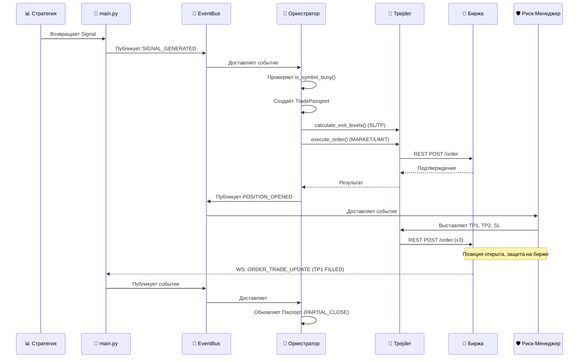

Отлично, запускаю генерацию **Архитектурного Манифеста**. 

Ниже представлен полный текст первого и самого важного файла — **`docs/00_ARCHITECTURE.md`**. Скопируй его и сохрани у себя в проекте в папке `docs/`. 

Этот документ самодостаточен: загрузив его в новый чат, я (или любая новая сессия) смогу за 10 секунд восстановить полную картину платформы, её философию, структуру и, что самое главное, **список всех критических проблем**, которые требуют твоего внимания.

---

# 📄 `docs/00_ARCHITECTURE.md`

```markdown
# 🏛️ Архитектурный Манифест: PLAT_WALLS_NEW

**Версия документа:** 1.0 (Сформировано по итогам полного ревью кода)
**Назначение:** Единый источник правды об архитектуре торговой платформы для автоматической торговли фьючерсами на Binance.

---

## 🎯 1. Назначение и Философия

`PLAT_WALLS_NEW` — это событийно-ориентированная (Event-Driven) торговая платформа, построенная на принципах слабой связности (loose coupling) и строгого разделения ответственности. 

### Три Столпа Архитектуры:
1. **Биржа — Абсолютный Источник Истины.** Внутреннее состояние платформы может устареть или повредиться. Единственная правда — это состояние позиции и ордеров на самой бирже. Все модули (особенно `RecoveryManager` и `StateManager`) постоянно сверяются с биржей.
2. **Паспорт (Passport) — Внутренний SSOT.** Для самой платформы единым источником правды является `TradePassport`. Ни один модуль не хранит состояние сделки у себя — они читают и пишут только в Паспорт.
3. **EventBus — Нервная Система.** Модули не вызывают методы друг друга напрямую (за редкими исключениями). Они публикуют и слушают события, что позволяет легко добавлять новые компоненты без переписывания старых.

---

## 🗺️ 2. Анатомия Платформы (Роли Компонентов)

Платформа построена по метафорическому принципу "организма":

| Метафора | Компонент | Файл | Ответственность |
| :--- | :--- | :--- | :--- |
| 🧠 **Мозг** | `Orchestrator` | `trading/orchestrator.py` | Принимает решения. Слушает сигналы, создаёт паспорта, дирижирует остальными модулями. |
| 👐 **Руки** | `Trader` | `trading/trader.py` | Только исполняет команды. Формирует запросы к API биржи, не думает о стратегии. |
| 🛡️ **Щит** | `RiskManager` | `trading/risk_manager.py` | Выставляет защитные ордера (TP1, TP2, SL) на биржу сразу после открытия позиции. |
| 👂 **Уши** | `BinanceWsAdapter` | `adapters/binance_ws.py` | Слушает рынок (стакан) и аккаунт (исполнения, позиции) через WebSocket. |
| 🌉 **Мост** | `BinanceRestClient` | `adapters/binance_rest.py` | Отправляет команды на биржу через REST API (с HMAC-подписью). |
| 📖 **Паспорт** | `TradePassport` | `trading/passport.py` | Dataclass, хранящий всю историю и состояние конкретной сделки. |
| 🚦 **Регулировщик** | `StateManager` | `trading/state_manager.py` | Конечный автомат. Контролирует допустимые переходы статусов Паспорта. |
| ⏱️ **Часовщик** | `LifecycleManager` | `trading/lifecycle_manager.py` | Следит за TTL лимитных входных ордеров (отменяет или конвертирует в маркет). |
| ♻️ **Реаниматолог** | `RecoveryManager` | `trading/recovery_manager.py` | Восстанавливает состояние платформы после краша или перезапуска. |
| 📊 **Аналитики** | Стратегии | `strategies/*.py` | Генерируют сигналы на основе рыночных данных. Не знают про ордера и паспорта. |

---

## 🔄 3. Жизненный Цикл Сделки (Data Flow)

Типовой сценарий от сигнала до закрытия:



---

## 📡 4. Шина Событий (EventBus)

EventBus реализован паттерном Publisher/Subscriber с параллельным исполнением обработчиков через `asyncio.gather`.

**Ключевые события платформы:**
- `SIGNAL_GENERATED` — Стратегия → Оркестратор
- `PASSPORT_CREATED` — Оркестратор → LifecycleManager (запуск TTL)
- `POSITION_OPENED` — Оркестратор → RiskManager (выставка TP/SL)
- `ORDER_TRADE_UPDATE` — WS Adapter → Оркестратор (исполнение ордеров)
- `ACCOUNT_UPDATE` — WS Adapter → Оркестратор (изменение позиции/баланса)
- `TTL_EXPIRED` — LifecycleManager → Оркестратор (истечение времени лимитки)
- `TP1_FILLED` / `POSITION_CLOSED` — Оркестратор → RiskManager/LifecycleManager

> ⚠️ **Архитектурный сдвиг:** Ранее планировалось, что внутренние статусы будут триггерами. Сейчас принято решение, что **только данные с биржи (WS/REST)** являются триггерами для изменений.

---

## ⚠️ 5. КРИТИЧЕСКИЙ TECH DEBT (Бэклог Задач)

Этот раздел содержит проблемы, выявленные при полном ревью кода. **Их необходимо решить перед переходом на Production.**

### 🔴 Блокеры (Blockers)

1. **Инвертированный Risk/Reward в `config/trading.json`**
   - **Суть:** `atr_multiplier_sl = 20.0`, а `atr_multiplier_tp1 = 2.0`. При статическом ATR=0.5 Стоп-Лосс получается в 10 раз больше, чем Тейк-Профит.
   - **Риск:** Математически убыточная стратегия. Винрейт должен быть ~90% для безубытка.
   - **Решение:** Исправить множители в конфиге или сделать ATR динамическим.

2. **Мёртвый Глобальный Risk-Менеджмент (`config/risk.json`)**
   - **Суть:** Параметры `max_daily_loss`, `max_drawdown`, `max_trades_per_hour` загружаются, но **нигде в коде не проверяются**.
   - **Риск:** При серии убытков платформа сольёт депозит, не остановившись.
   - **Решение:** Внедрить проверки лимитов в `Orchestrator._on_signal()` или создать `GlobalRiskManager`.

3. **Стратегия Breakout не работает (Нет свечей)**
   - **Суть:** `BreakoutStrategy` требует `context['candles']`, но `main.py` передаёт в контекст только цену и стакан.
   - **Риск:** Стратегия всегда возвращает `None` (Dead Code).
   - **Решение:** Добавить загрузку истории свечей в `main.py` или подписку на kline WS-стрим.

4. **Отключен RecoveryManager**
   - **Суть:** В `main.py` строка `await self.recovery_manager.recover()` закомментирована.
   - **Риск:** При перезапуске платформа "забывает" про открытые позиции и выставленные TP/SL на бирже.
   - **Решение:** Раскомментировать и доработать синхронизацию TP/SL ордеров.

5. **Утечка Секретов**
   - **Суть:** API-ключи лежат в `config/exchange.json` в открытом виде.
   - **Риск:** Компрометация ключей при коммите в Git.
   - **Решение:** Перенести ключи строго в `secrets.json`, добавить `exchange.json` в `.gitignore` (если там есть чувствительные данные).

### 🟡 Важные Улучшения (High Priority)

6. **Отсутствие Переноса SL в Безубыток**
   - **Суть:** В описании `RiskManager` заявлено, что при срабатывании TP1 SL переносится в безубыток. В коде этот метод отсутствует.
   - **Решение:** Реализовать логику отмены старого SL и выставления нового по цене входа в `Orchestrator` или `RiskManager`.

7. **Polling вместо Event-Driven для Стратегий**
   - **Суть:** `main.py` опрашивает стратегии каждые 2 секунды (`asyncio.sleep(2)`), а не по событию `depthUpdate`.
   - **Риск:** Задержка реакции на рынок, пропуск быстрых движений стенок.
   - **Решение:** Перевести вызов стратегий на колбэк `depthUpdate`.

8. **Избыточные REST-запросы**
   - **Суть:** В цикле `main.py` каждые 2 секунды делается `rest.get_position()`.
   - **Риск:** Быстрое исчерпание лимитов Binance API (Weight limits), возможный бан IP.
   - **Решение:** Убрать запрос из цикла. Позиция должна обновляться только из WS `ACCOUNT_UPDATE`.

9. **Статический ATR**
   - **Суть:** `atr_value = 0.5` берётся из конфига и не зависит от реальной волатильности.
   - **Решение:** Рассчитывать ATR динамически на основе последних N свечей.

10. **PnL всегда равен нулю**
    - **Суть:** При закрытии по TP/SL в `StateManager` передаётся `gross_pnl=0`.
    - **Решение:** Запрашивать историю сделок (`/fapi/v1/userTrades`) или брать PnL из WS `ACCOUNT_UPDATE`.

### 🟢 Рефакторинг и Чистота (Medium Priority)

11. **Дублирование кода подписи в `BinanceRestClient`** (нужно использовать общий `_request`).
12. **Отладочные `print()`** в `Orchestrator`, `RiskManager`, `REST` (заменить на `JsonLogger`).
13. **Мёртвые параметры в стратегиях** (`min_confidence`, `min_wall_volume` читаются, но не используются).
14. **Некорректный JSON-лог** (`JsonLogger` пишет битый JSON при краше, нужен переход на JSONL).
15. **Отсутствие `closes` и `volume` валидации** в стратегиях.

---

## 🛠️ 6. Принятые Архитектурные Решения (ADR)

- **ADR-1: Режим Хеджирования (Hedge Mode).** Платформа работает с `positionSide=LONG/SHORT`. Это позволяет в будущем держать разнонаправленные позиции, но требует явного указания стороны при отправке ордеров.
- **ADR-2: Exchange-Only для Защиты.** TP и SL выставляются реальными ордерами на биржу, а не отслеживаются внутри платформы. Если платформа упадёт, защита сработает автономно.
- **ADR-3: Обработка Частичного Исполнения.** TP1 закрывает 50% позиции, TP2 — оставшиеся 50%. SL изначально выставляется на 100% объёма (требует доработки после TP1).
- **ADR-4: Fallback на REST.** Так как методы отправки ордеров через WS (`ws.send_order`) не реализованы, `ChannelRouter` не используется, все команды идут через REST.

---
*Конец документа `00_ARCHITECTURE.md`*
```

---

### 🎯 Что дальше?

Ты сохранил этот файл? Если да, то **в любом новом чате** ты просто пишешь:
> *"Привет. Загружаю Манифест платформы PLAT_WALLS_NEW. Прочти `docs/00_ARCHITECTURE.md`, войди в курс дела и давай работать над [задача из бэклога]."*
И я мгновенно подхвачу контекст, зная про инвертированный R:R, мёртвый Breakout и все архитектурные нюансы.

**Готов генерировать следующий файл Манифеста?** 
Предлагаю **`docs/01_CORE_MODULES.md`**, куда я упакую детальные карточки `EventBus`, `types`, `config_loader` и системы логирования (`Logger` + `JsonLogger`). 

Скажи "Дальше", и я выдам его! 🚀