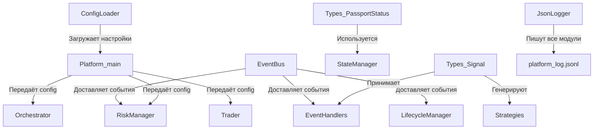

Отлично! Переходим к **`docs/01_CORE_MODULES.md`**. Этот файл описывает фундамент платформы, и за последние сессии в нём произошли значительные изменения — особенно в системе логирования.

---

## 📄 Обновленный `docs/01_CORE_MODULES.md`

```markdown
#  Ядро Платформы (Core Modules)

Этот документ описывает базовые инфраструктурные модули, на которых строится вся платформа `PLAT_WALLS_NEW`. Они не содержат бизнес-логики торговли, но обеспечивают связь, хранение настроек, типизацию и логирование.

---

## 📡 1. `core/event_bus.py` — Нервная Система

###  Назначение
Центральный механизм коммуникации между всеми модулями. Обеспечивает слабую связность (loose coupling) — компоненты общаются исключительно через события, не зная друг о друге.

### 🏗️ Роль в архитектуре
**«Нервная система».** Любой модуль может опубликовать событие, и любой другой модуль, подписанный на него, получит уведомление. Это позволяет добавлять новые модули без изменения существующих.

### 🔗 Публичные контракты
- **`subscribe(event_type, handler)`** — регистрирует асинхронный обработчик. Оборачивает его в `try/except` для изоляции ошибок.
- **`publish(event_type, source, payload, symbol, correlation_id=None)`** — доставляет событие всем подписчикам. Все обработчики запускаются **параллельно** через `asyncio.gather`. `publish` ждёт завершения всех обработчиков.
- **`clear()`** — удаляет все подписки (используется при остановке).

###  Структура события (`Event`)
| Поле | Назначение |
| :--- | :--- |
| `type` | Тип события (например, `SIGNAL_GENERATED`, `POSITION_OPENED`) |
| `source` | Кто опубликовал (`Orchestrator`, `BinanceWsAdapter`) |
| `payload` | Словарь с данными события |
| `symbol` | Торговый инструмент |
| `correlation_id` | ID для трассировки (обычно `passport_id`) — связывает события одной сделки |
| `timestamp` | Время создания (UTC, ISO) |

### ⚙️ Паттерны поведения
1. **Параллельное исполнение:** Обработчики не зависят от порядка, выполняются одновременно.
2. **Изоляция ошибок:** Падение одного подписчика не влияет на остальных (ошибка печатается в stdout).
3. **Блокирующий publish:** Вызывающий код ждёт, пока все подписчики обработают событие.

### ⚠️ Техдолг
- `_lock` создаётся, но не используется (потенциальная гонка при динамической подписке).
- Ошибки обработчиков выводятся через `print`, а не в `JsonLogger`.
- `datetime.utcnow()` deprecated в Python 3.12+.
- Нет метода `unsubscribe` (только полная очистка).

### 💡 Архитектурные заметки
> **Важное решение:** Изначально планировалось, что внутренние события (типа `POSITION_OPENED`) будут главными триггерами. Сейчас архитектура сместилась к принципу **«Биржа = источник истины»**. События шины становятся преимущественно **информационными** (транспорт данных), а решения принимаются на основе фактических апдейтов с биржи (`ORDER_TRADE_UPDATE`, `ACCOUNT_UPDATE`).

---

## 📖 2. `core/types.py` — Словарь Платформы

### 📌 Назначение
Централизованный реестр всех структур данных и перечислений (enums). Гарантирует, что все модули одинаково понимают, что такое «ордер», «сигнал» или «статус паспорта».

### 🔢 Перечисления (Enums)

#### `PassportStatus` (Основа конечного автомата)
Описывает весь жизненный цикл сделки:
`SIGNAL_GENERATED` → `ORDER_SENT` → `ORDER_ACK` → `LIMIT_ON_BOOK` → `OPEN` → `PARTIAL_CLOSE` → `CLOSING` → `CLOSED`

Также есть терминальные: `CANCELED`, `FAILED`, `UNKNOWN`.

> ⚠️ *Примечание:* В связи с переходом на «Биржу как источник истины», статусы паспорта всё чаще используются для **аудита и логирования**, а не как жёсткие триггеры для принятия решений.

#### `OrderType`, `OrderSide`, `OrderStatus`
Базовые перечисления для ордеров. `OrderType` покрывает `MARKET` и `LIMIT`. STOP-ордера пока передаются строками или через хаки в REST-клиенте.

###  Структуры данных (Dataclasses)

| Класс | Назначение | Ключевые поля |
| :--- | :--- | :--- |
| **`Signal`** | Сигнал от стратегии | `signal_id`, `symbol`, `side`, `entry_price`, `confidence`, `strategy`, `metadata` |
| **`Order`** | Ордер | `order_id`, `client_order_id`, `symbol`, `side`, `price`, `quantity`, `filled_quantity`, `status` |
| **`Position`** | Позиция | `symbol`, `side`, `size`, `entry_price`, `current_price`, `unrealized_pnl` |

### ️ Критическое замечание по `Signal`

**В классе `Signal` отсутствует поле `quantity`.** Это архитектурное решение: стратегия отвечает только за **точку входа** (цена, направление, уверенность), но не за размер позиции.

Размер позиции определяется на стороне `Orchestrator` через `trader._get_lot_size()`, который берёт значение из конфигурации (`lot_size`). Это обеспечивает:
- Единый источник истины для размера лота.
- Возможность централизованно менять размер без правки стратегий.
- Защиту от ошибок стратегий (если стратегия забудет посчитать лот).

### ⚠️ Техдолг
- **Отсутствует `EventType` (Enum для событий).** Типы событий (`SIGNAL_GENERATED`, `POSITION_OPENED`) передаются как сырые строки, что создаёт риск опечаток.
- В dataclass'ах используются строки вместо enum-типов (ослабленная типизация).
- Поле `signal_id` в `Signal` — свежая добавка, нужно убедиться, что все стратегии его заполняют.
- `timestamp` в `Order` — секунды Unix-времени (но Binance часто отдаёт миллисекунды, требуется осторожность при парсинге).

---

## 📚 3. `core/config_loader.py` — Библиотекарь

### 📌 Назначение
Утилита для загрузки конфигурационных JSON-файлов. Обеспечивает централизованный доступ к настройкам.

### 🔗 Публичные контракты
- **`load(name)`** — загружает `{name}.json`.
- **`load_all()`** — загружает 4 основных конфига: `exchange`, `trading`, `risk`, `strategies`.
- **`load_secrets()`** — загружает `secrets.json` с API-ключами (выделен отдельно для безопасности).

### ⚙️ Паттерны поведения
- **Молчаливое отсутствие файла:** Если файла нет, возвращается пустой словарь `{}`. Платформа не падает, а использует дефолты из кода.
- **Секреты отдельно:** `load_secrets()` не смешивается с обычными конфигами.

### ⚠️ Техдолг и Риски
🔴 **Молчаливое возвращение `{}` — главный риск.** 
Если пользователь забудет создать `risk.json`, платформа запустится с пустым конфигом, и `RiskManager` может не выставить защиту или использовать некорректные параметры. Нет валидации схемы (например, через `pydantic`).

**Рекомендация:** Для критичных конфигов падать с понятной ошибкой, если файл отсутствует.

---

## 📝 4. Система Логирования (`logger.py` + `json_logger.py`)

Платформа использует **двухканальную систему логирования**:

### 🗣️ `core/logger.py` (Консольный лог)
- **Роль:** «Голос платформы» для человека.
- **Формат:** `YYYY-MM-DD HH:MM:SS | LEVEL | NAME | MESSAGE`
- **Особенность:** Защита от дублирования handlers при повторном создании.

###  `core/json_logger.py` (Файловый структурированный лог) — v2.0

- **Роль:** «Чёрный ящик» для машины (аудит, анализ, трассировка сделок).
- **Формат:** **JSONL (JSON Lines)** — каждая строка файла является самостоятельным валидным JSON-объектом.
- **Файл:** `logs/platform_log.jsonl`.

#### Структура записи:
```json
{"timestamp": "2026-08-19T10:38:44.851533", "module": "orchestrator", "event": "signal_received", "level": "INFO", "data": {...}, "correlation_id": "PASS_..."}
```

#### Ключевые поля:
| Поле | Назначение |
| :--- | :--- |
| `timestamp` | Время события (UTC, ISO) |
| `module` | Модуль-источник (`orchestrator`, `ws`, `risk_manager`, `platform`) |
| `event` | Тип события (`signal_received`, `order_sent`, `guard_registered`) |
| `level` | Уровень (`INFO`, `WARNING`, `ERROR`, `DEBUG`) |
| `data` | Словарь с данными события |
| `correlation_id` | *(опционально)* ID паспорта для трассировки сделки |

#### Архитектурные улучшения v2.0:

1. **Переход на JSONL:**
   - Файл всегда валиден, даже при аварийной остановке (`kill -9`, крах питания).
   - Не требует вызова `close()` для корректного завершения.
   - Легко читается построчно без загрузки всего файла в память.
   - Упрощает ротацию и анализ внешними инструментами (jq, grep, ELK).

2. **Автоматическая ротация:**
   - При достижении 5 МБ текущий файл переименовывается в `platform_log_YYYYMMDD_HHMMSS.jsonl`.
   - Создаётся новый пустой файл.
   - Предотвращает бесконечный рост лога.

3. **Трассировка через `correlation_id`:**
   - Все события, связанные с одной сделкой, имеют одинаковый `correlation_id` (равный `passport_id`).
   - Позволяет мгновенно собрать полный timeline сделки одной командой:
     ```powershell
     Select-String -Path "logs\platform_log.jsonl" -Pattern "PASS_..." 
     ```

4. **Фильтрация шума:**
   - Технические WS-события (ping/pong, подтверждения подписки с `{"result": null, "id": 1}`) **игнорируются** и не пишутся в лог.
   - Уменьшает размер лога в 3-5 раз.

5. **Усечение payload:**
   - Для `ORDER_TRADE_UPDATE` в лог пишется только 8 ключевых полей (`symbol`, `client_order_id`, `side`, `type`, `status`, `quantity`, `price`, `position_side`) вместо 40+ полей сырого ответа Binance.
   - Сохраняет всю необходимую информацию для отладки без мусора.

6. **Увеличенный порог Health Check:**
   - Порог "мёртвого" WebSocket увеличен с 30 до 60 секунд.
   - Предотвращает ложные срабатывания на спокойном рынке, когда цена не меняется.

#### Пример типичной трассировки сделки:
```
signal_received → passport_created → levels_calculated_for_passport → 
order_sent_and_added_to_passport → order_update_received (FILLED) → 
order_filled_and_passport_updated → guard_registered
```
Все записи связаны одним `correlation_id`.

### ⚠️ Оставшийся техдолг логирования
- Молчаливое проглатывание ошибок записи: если диск переполнен, платформа не узнает об этом (защита от краха ценой потери лога).
- Нет централизованного управления уровнем логирования (например, переключение на `DEBUG` без перезапуска).
- Консольный логгер всё ещё использует `print()` в некоторых местах вместо `logging`.

---

## 🔗 Связь модулей Core с остальной платформой



---

*Конец документа `01_CORE_MODULES.md`*
 🚀