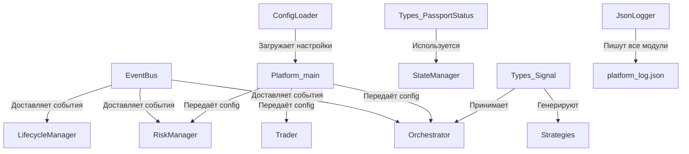

Отлично, продолжаем формирование Манифеста. Ниже представлен полный текст второго файла — **`docs/01_CORE_MODULES.md`**. 

Этот документ описывает фундамент платформы: шину событий, типы данных, загрузку конфигурации и систему логирования. Скопируй его и сохрани в папку `docs/`.

---

# 📄 `docs/01_CORE_MODULES.md`

```markdown
# 🧱 Ядро Платформы (Core Modules)

Этот документ описывает базовые инфраструктурные модули, на которых строится вся платформа `PLAT_WALLS_NEW`. Они не содержат бизнес-логики торговли, но обеспечивают связь, хранение настроек, типизацию и логирование.

---

## 📡 1. `core/event_bus.py` — Нервная Система

### 📌 Назначение
Центральный механизм коммуникации между всеми модулями. Обеспечивает слабую связность (loose coupling) — компоненты общаются исключительно через события, не зная друг о друге.

### 🏗️ Роль в архитектуре
**«Нервная система».** Любой модуль может опубликовать событие, и любой другой модуль, подписанный на него, получит уведомление. Это позволяет добавлять новые модули без изменения существующих.

### 🔗 Публичные контракты
- **`subscribe(event_type, handler)`** — регистрирует асинхронный обработчик. Оборачивает его в `try/except` для изоляции ошибок.
- **`publish(event_type, source, payload, symbol, correlation_id)`** — доставляет событие всем подписчикам. Все обработчики запускаются **параллельно** через `asyncio.gather`. `publish` ждёт завершения всех обработчиков.
- **`clear()`** — удаляет все подписки (используется при остановке).

### 📦 Структура события (`Event`)
| Поле | Назначение |
| :--- | :--- |
| `type` | Тип события (например, `SIGNAL_GENERATED`, `POSITION_OPENED`) |
| `source` | Кто опубликовал (`Orchestrator`, `BinanceWsAdapter`) |
| `payload` | Словарь с данными события |
| `symbol` | Торговый инструмент |
| `correlation_id` | ID для трассировки (задел на будущее) |
| `timestamp` | Время создания (UTC, ISO) |

### ⚙️ Паттерны поведения
1. **Параллельное исполнение:** Обработчики не зависят от порядка, выполняются одновременно.
2. **Изоляция ошибок:** Падение одного подписчика не влияет на остальных (ошибка печатается в stdout).
3. **Блокирующий publish:** Вызывающий код ждёт, пока все подписчики обработают событие.

### ⚠️ Техдолг
- `_lock` создаётся, но не используется (потенциальная гонка при динамической подписке).
- Ошибки обработчиков выводятся через `print`, а не в `JsonLogger`.
- `datetime.utcnow()` deprecated в Python 3.12+.
- Нет метода `unsubscribe` (только полная очистка).

### 💡 Архитектурные заметки
> **Важное решение:** Изначально планировалось, что внутренние события (типа `POSITION_OPENED`) будут главными триггерами. Сейчас архитектура сместилась к принципу **«Биржа = источник истины»**. События шины становятся преимущественно **информационными** (транспорт данных), а решения принимаются на основе фактических апдейтов с биржи (`ORDER_TRADE_UPDATE`, `ACCOUNT_UPDATE`).

---

## 📖 2. `core/types.py` — Словарь Платформы

### 📌 Назначение
Централизованный реестр всех структур данных и перечислений (enums). Гарантирует, что все модули одинаково понимают, что такое «ордер», «сигнал» или «статус паспорта».

### 🔢 Перечисления (Enums)

#### `PassportStatus` (Основа конечного автомата)
Описывает весь жизненный цикл сделки:
`SIGNAL_GENERATED` → `ORDER_SENT` → `ORDER_ACK` → `LIMIT_ON_BOOK` → `OPEN` → `PARTIAL_CLOSE` → `CLOSING` → `CLOSED`
Также есть терминальные: `CANCELED`, `FAILED`, `UNKNOWN`.

> ⚠️ *Примечание:* В связи с переходом на «Биржу как источник истины», статусы паспорта всё чаще используются для **аудита и логирования**, а не как жёсткие триггеры для принятия решений.

#### `OrderType`, `OrderSide`, `OrderStatus`
Базовые перечисления для ордеров. `OrderType` покрывает `MARKET` и `LIMIT`. STOP-ордера пока передаются строками или через хаки в REST-клиенте.

### 📦 Структуры данных (Dataclasses)

| Класс | Назначение | Ключевые поля |
| :--- | :--- | :--- |
| **`Signal`** | Сигнал от стратегии | `signal_id`, `symbol`, `side`, `entry_price`, `confidence`, `strategy`, `metadata` |
| **`Order`** | Ордер | `order_id`, `client_order_id`, `symbol`, `side`, `price`, `quantity`, `filled_quantity`, `status` |
| **`Position`** | Позиция | `symbol`, `side`, `size`, `entry_price`, `current_price`, `unrealized_pnl` |

### ⚠️ Техдолг
- **Отсутствует `EventType` (Enum для событий).** Типы событий (`SIGNAL_GENERATED`, `POSITION_OPENED`) передаются как сырые строки, что создаёт риск опечаток.
- В dataclass'ах используются строки вместо enum-типов (ослабленная типизация).
- Поле `signal_id` в `Signal` — свежая добавка, нужно убедиться, что все стратегии его заполняют.
- `timestamp` в `Order` — секунды Unix-времени (но Binance часто отдаёт миллисекунды, требуется осторожность при парсинге).

---

## 📚 3. `core/config_loader.py` — Библиотекарь

### 📌 Назначение
Утилита для загрузки конфигурационных JSON-файлов. Обеспечивает централизованный доступ к настройкам.

### 🔗 Публичные контракты
- **`load(name)`** — загружает `{name}.json`.
- **`load_all()`** — загружает 4 основных конфига: `exchange`, `trading`, `risk`, `strategies`.
- **`load_secrets()`** — загружает `secrets.json` с API-ключами (выделен отдельно для безопасности).

### ⚙️ Паттерны поведения
- **Молчаливое отсутствие файла:** Если файла нет, возвращается пустой словарь `{}`. Платформа не падает, а использует дефолты из кода.
- **Секреты отдельно:** `load_secrets()` не смешивается с обычными конфигами.

### ⚠️ Техдолг и Риски
🔴 **Молчаливое возвращение `{}` — главный риск.** 
Если пользователь забудет создать `risk.json`, платформа запустится с пустым конфигом, и `RiskManager` может не выставить защиту или использовать некорректные параметры. Нет валидации схемы (например, через `pydantic`).

**Рекомендация:** Для критичных конфигов падать с понятной ошибкой, если файл отсутствует.

---

## 📝 4. Система Логирования (`logger.py` + `json_logger.py`)

Платформа использует **двухканальную систему логирования**:

### 🗣️ `core/logger.py` (Консольный лог)
- **Роль:** «Голос платформы» для человека.
- **Формат:** `YYYY-MM-DD HH:MM:SS | LEVEL | NAME | MESSAGE`
- **Особенность:** Защита от дублирования handlers при повторном создании.

### 💾 `core/json_logger.py` (Файловый структурированный лог)
- **Роль:** «Чёрный ящик» для машины (аудит, анализ, `RecoveryManager`).
- **Формат:** JSON-объекты с полями `timestamp`, `module`, `event`, `level`, `data`.
- **Файл:** `logs/platform_log.json`.

### 🚨 Критическая проблема `JsonLogger`
**Битый JSON при аварийной остановке.**
Во время работы файл представляет собой **незакрытый массив**:
```json
[
{"timestamp": "...", ...},
{"timestamp": "...", ...},
```
Файл становится валидным JSON **только** после вызова `close()` (при graceful shutdown). Если платформа упадёт (крах, kill -9, сбой питания), файл останется битым, и парсеры откажутся его читать.

**Решение (High Priority):** Перейти на формат **JSON Lines (JSONL)**, где каждая строка — отдельный валидный JSON. Это сделает файл всегда читаемым, уберёт необходимость в `close()` и позволит читать лог построчно без загрузки в память.

### ⚠️ Дополнительный техдолг
- **Нет ротации логов:** `platform_log.json` растёт бесконечно. Нужна ежедневная ротация или лимит по размеру.
- **Нет `correlation_id`:** События не связываются с конкретным паспортом сделки. Добавление `correlation_id` в `log()` позволит строить полные timeline сделок.
- **Молчаливое проглатывание ошибок записи:** Если диск переполнен, платформа не узнает об этом.

---

## 🔗 Связь модулей Core с остальной платформой



---
*Конец документа `01_CORE_MODULES.md`*
```

---

### 🎯 Что дальше?

Следующий логичный блок — **Торговое Ядро (Trading Core)**. Это самая насыщенная часть платформы, где сосредоточена вся бизнес-логика. 

Предлагаю разбить его на два файла, чтобы не делать один гигантский документ:

1. **`docs/03_TRADING_CORE.md`** — Мозг и Руки (`Orchestrator`, `Trader`, `ExitCalculator`, `StateManager`).
2. **`docs/04_PASSPORT_AND_RISK.md`** — Паспорт, Хранилища и Защита (`TradePassport`, `PassportManager`, `PassportRepository`, `RiskManager`, `LifecycleManager`, `RecoveryManager`).

**Готов выдать `docs/03_TRADING_CORE.md`? Скажи "Дальше", и я сгенерирую его!** 🚀