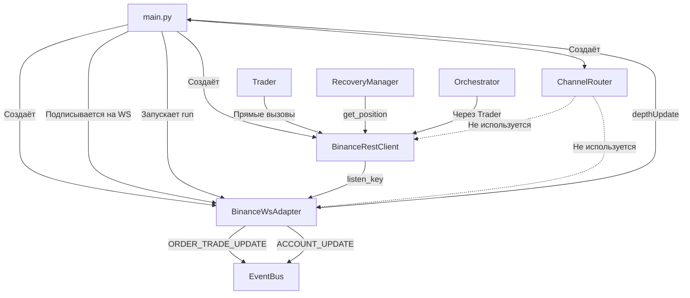

Отлично, продолжаем формирование Манифеста. Ниже представлен полный текст третьего файла — **`docs/02_ADAPTERS.md`**. Скопируй его и сохрани в папку `docs/`.

---

# 📄 `docs/02_ADAPTERS.md`

```markdown
# 📡 Адаптеры (Adapters)

Этот документ описывает слой взаимодействия платформы с биржей Binance. Адаптеры скрывают детали API и предоставляют унифицированный интерфейс для торговых модулей.

**Принцип:** «WS — для данных, REST — для команд».

---

## 🌉 1. `adapters/binance_rest.py` — Мост

### 📌 Назначение
HTTP-клиент для отправки **команд** на биржу: создание/отмена ордеров, запрос позиций, управление `listen_key`. Все приватные запросы подписываются через HMAC-SHA256.

### 🏗️ Роль
**«Мост» к бирже.** Единственный модуль, который напрямую обращается к Binance REST API. Trader, Orchestrator и RecoveryManager работают с ним через публичные методы.

### 🔗 Публичные контракты

| Метод | Назначение |
| :--- | :--- |
| `create_market_order(...)` | Рыночный ордер (поддерживает `reduce_only`, `position_side`) |
| `create_limit_order(...)` | Лимитный ордер (`timeInForce='GTC'`) |
| `create_stop_market_order(...)` | ⚠️ **ВРЕМЕННОЕ РЕШЕНИЕ** для Testnet: отправляет LIMIT вместо STOP |
| `create_stop_limit_order(...)` | ⚠️ **ВРЕМЕННОЕ РЕШЕНИЕ** для Testnet: отправляет LIMIT вместо STOP |
| `cancel_order(symbol, order_id)` | Отмена ордера через DELETE-запрос |
| `get_position(symbol)` | Запрос позиции через `/fapi/v2/positionRisk` (ищет ненулевой размер) |
| `get_orderbook(symbol, limit)` | Запрос стакана через `/fapi/v1/depth` |
| `get_listen_key()` | Получение `listenKey` для User Data Stream |
| `renew_listen_key(key)` | Продление жизни `listenKey` |
| `close()` | Закрытие aiohttp-сессии |

### ⚙️ Паттерны поведения
1. **Подпись запросов (HMAC-SHA256):** параметры сортируются, формируется query string, вычисляется подпись.
2. **Ленивая инициализация сессии:** `aiohttp.ClientSession` создаётся при первом запросе.
3. **Унифицированный формат ответов:** все методы возвращают словарь `{'success', 'order_id', 'client_order_id', 'status', 'raw_response'}` или `{'success': False, 'error'}`.
4. **Обработка ошибок Binance:** если ответ содержит `code`, ошибка логируется и возвращается `{'success': False}`.

### ⚠️ Техдолг

#### 🔴 Критический
1. **Дублирование кода подписи.** Каждый метод (`create_market_order`, `create_limit_order`, `cancel_order`, `get_position`) вручную формирует подпись (50+ строк дублирующегося кода). Есть общий `_request(signed=True)`, но он не используется.
   - **Риск:** изменение логики подписи нужно делать в 5-6 местах; легко ошибиться.
   - **Решение:** переписать все методы через `_request()`.

2. **Временные решения для стоп-ордеров на Testnet.** `create_stop_market_order()` и `create_stop_limit_order()` отправляют обычные LIMIT-ордера вместо настоящих стопов.
   - **Риск:** на продакшене это не будет работать; ордера исполняются сразу, а не по триггеру.
   - **Решение:** добавить флаг `is_testnet` и разные реализации для тестнета и прода.

#### 🟡 Важный
3. **Нет retry-логики.** При таймауте или сетевой ошибке клиент возвращает ошибку без повторной попытки.
4. **Нет rate limiter.** При активной торговле можно получить `429 Too Many Requests` или бан IP.
5. **`recvWindow = 60000`** (60 секунд) — слишком большое окно; маскирует проблемы с синхронизацией времени.
6. **Отладочные `print()`** в методах ордеров (заменить на `logger`).
7. **Нет валидации параметров** (`quantity > 0`, `price > 0`).
8. **`position_side='BOTH'` по умолчанию** — режим One-Way, но платформа работает в Hedge Mode (`LONG`/`SHORT`).

### 💡 Edge-cases
- **Рассинхронизация времени:** если время на сервере отстаёт > `recvWindow`, запросы отклоняются с `-1021`.
- **Таймаут при отправке ордера:** ордер мог быть отправлен, но ответ не дошёл. Нужна проверка статуса по `client_order_id`.
- **Несколько позиций по одному символу (Hedge Mode):** `get_position()` возвращает первую ненулевую позицию; нужна фильтрация по `positionSide`.

---

## 👂 2. `adapters/binance_ws.py` — Уши

### 📌 Назначение
WebSocket-клиент для получения данных с биржи в реальном времени: стакан, исполнение ордеров, изменение позиций. Пассивный канал — только слушает.

### 🏗️ Роль
**«Уши» платформы.** Приоритетный источник информации о рынке и счёте. Позволяет реагировать за миллисекунды и экономить лимиты REST API.

### 🔗 Публичные контракты

| Метод | Назначение |
| :--- | :--- |
| `connect(retries=3)` | Подключение с повторными попытками; вызывает `_on_reconnect` при успехе |
| `run()` | Основной цикл обработки входящих сообщений |
| `stop()` | Остановка цикла и закрытие соединения |
| `subscribe_depth(symbol)` | Подписка на стакан (`@depth20@100ms`) |
| `subscribe_user_data(listen_key)` | Подписка на User Data Stream |
| `on(event_type, handler)` | Регистрация обработчика события |
| `set_json_logger(logger)` | Установка JSON-логгера |
| `ping()` | Проверка живости соединения |
| `health_check_loop(interval)` | Фоновая проверка здоровья |
| `is_healthy()` | Возврат статуса здоровья |

### 📨 Обрабатываемые события

| Событие | Что парсится | Куда передаётся |
| :--- | :--- | :--- |
| `ORDER_TRADE_UPDATE` | Поля ордера из `o`: `i`, `c`, `s`, `S`, `X`, `p`, `q`, `z` | Обработчик `ORDER_TRADE_UPDATE` |
| `ACCOUNT_UPDATE` | Позиции из `a.P`: `s`, `pa`, `ep`, `up` | Обработчик `ACCOUNT_UPDATE` |
| `depthUpdate` | **Сырое сообщение** (парсинг в `main.py`) | Обработчик `depthUpdate` |
| Остальные | Только логируются в JSON | — |

### ⚙️ Паттерны поведения
1. **Двойное логирование:** все события пишутся в `JsonLogger` (для аудита), но в консоль выводятся только важные (`ORDER_TRADE_UPDATE`, `ACCOUNT_UPDATE`).
2. **Автоматическое переподключение:** при `ConnectionClosed` вызывается `connect()`, затем `_on_reconnect` (обновление `listen_key`, `SYNC_REQUEST`).
3. **Упрощённый health check:** проверяет только, что `_ws` не None.

### ⚠️ Техдолг

#### 🔴 Критический
1. **`_healthy` не инициализируется в `__init__`.** Если `is_healthy()` вызывается до `health_check_loop()`, будет `AttributeError`.
   - **Решение:** добавить `self._healthy = False` в `__init__`.

2. **Методы отправки команд через WS не реализованы.** `send_order()`, `cancel_order()`, `get_position()` возвращают `{'success': False, 'error': 'not implemented'}`.
   - **Риск:** если `ChannelRouter` попытается использовать WS, команды не отправятся.
   - **Решение:** либо реализовать методы (Binance поддерживает WS-торговлю), либо убрать из интерфейса.

#### 🟡 Важный
3. **Упрощённый health check.** Не проверяет, приходят ли данные (соединение может быть «зомби»).
4. **Snapshot стакана вместо diff.** `@depth20@100ms` — полный стакан каждые 100 мс; больше трафика, чем diff-обновления.
5. **`ACCOUNT_UPDATE` игнорирует балансы** (`B` в payload). Платформа не отслеживает доступную маржу.
6. **Нет механизма отписки** (`unsubscribe`).
7. **Обработчики вызываются последовательно** — медленный обработчик блокирует остальные.
8. **Нет буферизации сообщений при разрыве** — данные теряются до синхронизации через REST.

### 💡 Edge-cases
- **`depthUpdate` передаётся «сырым»** — парсинг стакана происходит в `main.py`, что нарушает единую ответственность.
- **Несколько позиций в `ACCOUNT_UPDATE`** — адаптер обрабатывает каждую отдельно; фильтрация по символу — на стороне Orchestrator.
- **`listen_key` истёк** — `_keep_alive_loop` продлевает ключ каждые 20 минут; если продление не удалось, User Data Stream молча перестаёт работать.

---

## 🔀 3. `adapters/channel_router.py` — Диспетчер (задел на будущее)

### 📌 Назначение
Маршрутизатор, который должен выбирать канал (WS или REST) для отправки команд и запроса данных. Если WS здоров — команды идут через WS (быстрее, экономит лимиты); если упал — fallback на REST.

### 🏗️ Роль
**«Диспетчер каналов».** Задумывался как прозрачная прослойка между `Trader` и биржей.

### 🔗 Публичные контракты

| Метод | Назначение |
| :--- | :--- |
| `send_order(symbol, side, quantity, ...)` | Отправка ордера через WS (основной) или REST (резерв) |
| `cancel_order(symbol, order_id)` | Отмена ордера через WS или REST |
| `get_position(symbol)` | Запрос позиции через WS или REST |
| `set_ws_healthy(status)` | Принудительная установка статуса WS |

### 🚨 Критический архитектурный баг (Ловушка Fallback'а)

В текущем состоянии Router **не может работать**, даже если его подключить к Trader.

**Логика:**
```python
if self.ws_healthy and self.ws.is_healthy():
    return await self.ws.send_order(...)  # WS возвращает {'success': False, 'error': 'not implemented'}
else:
    return await self.rest.create_market_order(...)
```

**Проблема:** если WS «здоров» (`ws_healthy=True`, `is_healthy()=True`), но метод не реализован, Router вернёт ошибку **без автоматического fallback на REST**. Ордер не будет отправлен.

**Вывод:** логика fallback'а сработает только если WS физически упал (соединение закрыто). Именно поэтому `Trader` сейчас работает напрямую с REST, игнорируя Router.

### ⚠️ Дополнительный техдолг
1. **Несовпадение сигнатур методов.** `rest.create_market_order()` принимает `reduce_only`, `position_side`, `order_type`; `ws.send_order()` — только базовые параметры. Router не может передать расширенные параметры.
2. **Отсутствует умный fallback.** Правильный паттерн: проверить результат вызова WS и при ошибке «not implemented» переключиться на REST.
3. **`get_position` без параметров** — нет фильтрации по `positionSide` для Hedge Mode.

### 📋 Статус
⚠️ **Не используется.** `Trader` получает прямые ссылки на `BinanceRestClient` и `BinanceWsAdapter`, работая с REST напрямую. Router инициализируется в `main.py` (`self.router = ChannelRouter(...)`), но никуда не передаётся.

**План:** активировать после реализации отправки ордеров через Binance WS API.

---

## 🔗 Связь адаптеров с платформой



---

## ⚠️ Сводка критических проблем адаптеров

| # | Проблема | Модуль | Приоритет |
| :--- | :--- | :--- | :--- |
| 1 | Дублирование кода подписи (5+ мест) | `binance_rest.py` | 🔴 High |
| 2 | Стоп-ордера на Testnet — это лимитные (временный хак) | `binance_rest.py` | 🔴 High |
| 3 | `_healthy` не инициализирован в `__init__` | `binance_ws.py` | 🔴 High |
| 4 | Методы отправки команд через WS не реализованы | `binance_ws.py` | 🔴 High |
| 5 | ChannelRouter не используется из-за ловушки fallback'а | `channel_router.py` | 🟡 Medium |
| 6 | Нет retry-логики при сетевых ошибках | `binance_rest.py` | 🟡 Medium |
| 7 | Нет rate limiter | `binance_rest.py` | 🟡 Medium |
| 8 | Упрощённый health check WS | `binance_ws.py` | 🟡 Medium |
| 9 | Snapshot стакана вместо diff | `binance_ws.py` | 🟢 Low |
| 10 | Нет обработки балансов в `ACCOUNT_UPDATE` | `binance_ws.py` | 🟢 Low |

---
*Конец документа `02_ADAPTERS.md`*
```

---

### 🎯 Что дальше?

Следующий блок — **Торговое Ядро (Trading Core)**. Это самая насыщенная часть платформы, где сосредоточена вся бизнес-логика. 

Предлагаю разбить его на два файла, чтобы не делать один гигантский документ:

1. **`docs/03_TRADING_CORE.md`** — Паспорт, StateManager, Orchestrator, Trader, ExitCalculator (сердце принятия решений).
2. **`docs/04_RISK_LIFECYCLE.md`** — RiskManager, LifecycleManager, RecoveryManager (защита и восстановление).

**Готов выдать `docs/03_TRADING_CORE.md`? Скажи "Дальше", и я сгенерирую его!** 🚀