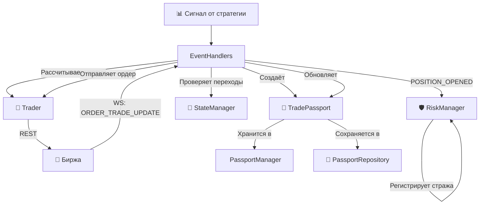

#  Торговое Ядро (Trading Core) — v2.0

Этот документ описывает модули, которые принимают решения, управляют состоянием сделок и исполняют команды. Это сердце платформы `PLAT_WALLS_NEW`.

**Версия:** 2.0 (Обновлено после рефакторинга Orchestrator и критических исправлений)

---

## 🗺️ Общая схема взаимодействия



---

## 📖 1. `trading/passport.py` — Цифровой Паспорт Сделки (SSOT)

### 📌 Назначение
Полный цифровой след конкретной торговой операции от момента генерации сигнала до закрытия позиции. Это единый источник правды (SSOT) для платформы.

###  Структура данных

| Группа | Поля | Назначение |
| :--- | :--- | :--- |
| Идентификация | `passport_id`, `symbol`, `status` | Уникальный ID (`PASS_YYYYMMDD_HHMMSS_<hex>`), инструмент, текущий статус |
| Сигнал | `signal_id`, `strategy`, `side`, `entry_price`, `confidence` | Исходные данные сигнала |
| Уровни | `sl_price`, `tp1_price`, `tp2_price` | Рассчитанные уровни защиты (заполняются в `EventHandlers`) |
| Позиция | `position_size`, `position_entry_price` | Фактическое состояние позиции (обновляется при `FILLED`) |
| Ордера | `orders: List[Dict]` | Список всех ордеров, связанных со сделкой |
| Время | `created_at`, `updated_at`, `closed_at` | Временные метки (UTC, ISO) |
| История | `timeline: List[Dict]` | Append-only лог событий паспорта |
| Результат | `exit_reason`, `exit_price`, `gross_pnl`, `commission`, `net_pnl` | Финансовый итог сделки |

### ️ Паттерны поведения
- Автоматическое обновление `updated_at` при любом изменении.
- Append-only timeline — история только дополняется, не изменяется.
- Генерация ID: `PASS_<дата_время>_<6_символов_uuid>`.

### ️ Техдолг
- 🟡 `orders` хранит сырые словари, а не объекты `Order` из `types.py`.
-  Нет защиты от двойного закрытия через `close()`.
- 🟡 Нет методов `update_position()` и `update_order()` — поля модифицируются напрямую извне.

---

##  2. `trading/state_manager.py` — Регулировщик (Конечный Автомат)

### 📌 Назначение
Контролирует допустимые переходы между статусами паспорта. Гарантирует, что паспорт не может перейти в недопустимое состояние.

### 🗺️ Карта разрешённых переходов

```
SIGNAL_GENERATED ─┬──► ORDER_SENT
                    ├──► CANCELED
                    └──► CLOSED
 ORDER_SENT ────────┬──► ORDER_ACK
                    ├──► OPEN (MARKET может сразу стать OPEN)
                    ├──► CANCELED
                    └──► FAILED
 ORDER_ACK ─────────┬──► LIMIT_ON_BOOK
                    ├──► OPEN
                    ├──► CANCELED
                    └──► FAILED
 LIMIT_ON_BOOK ─────┬──► OPEN
                    ├──► CANCELED
                    └──► FAILED
 OPEN ──────────────┬──► PARTIAL_CLOSE
                    ├──► CLOSING
                    ├──► CLOSED
                    └──► CANCELED
 PARTIAL_CLOSE ─────┬──► OPEN (возврат!)
                    ├──► CLOSING
                    └──► CLOSED
 CLOSING ───────────┬──► CLOSED
                    └──► FAILED
 CANCELED ──────────► (терминальное)
 CLOSED ────────────► (терминальное)
 FAILED ────────────► (терминальное)
```

### ⚠️ Техдолг
- 🔴 `print()` вместо `JsonLogger`. Переходы статусов не попадают в структурированный лог.
- 🔴 Нет обработки `UNKNOWN` статуса.
- 🟡 Прямая модификация полей паспорта в `handle_event()` — нарушение инкапсуляции.

---

## ️ 3. `trading/passport_manager.py` — Картотека (In-memory кэш)

### 📌 Назначение
Кэш всех паспортов в памяти. Отвечает исключительно за CRUD-операции.

### 🔗 Публичные контракты

| Метод | Назначение |
| :--- | :--- |
| `get(passport_id)` | Возвращает паспорт или `None` |
| `get_all()` | Все паспорта (включая закрытые) |
| `get_active()` | Паспорта, которые не являются `CLOSED` или `CANCELED`. ⚠️ `FAILED` не исключается! |
| `get_by_symbol(symbol)` | Все паспорта по символу |
| `get_active_by_symbol(symbol)` | Первый найденный активный паспорт по символу |
| `is_symbol_busy(symbol)` | Проверка, есть ли активный паспорт по символу. **Ключевая защита** от нескольких позиций |
| `update(passport)` | Перезаписывает паспорт в кэше |
| `remove(passport_id)` | Удаляет паспорт из кэша |

### ⚠️ Техдолг
- 🔴 `FAILED` не исключается из активных. Если паспорт упал в `FAILED`, символ остаётся «занятым».
- 🟡 Нет ограничения на размер кэша. Паспорта накапливаются бесконечно.

---

## 💾 4. `trading/passport_repository.py` — Архив (Персистентность)

### 📌 Назначение
Слой долговременного хранения паспортов на диске. Сериализует паспорт в JSON и десериализует обратно.

### ⚠️ Техдолг
- 🔴 Отсутствие атомарности записи. Если платформа упадёт во время `save()`, файл останется битым.
-  Нет обработки ошибок.
- 🟡 Нет ротации/архивации. Файлы накапливаются бесконечно.

---

## 🧠 5. `trading/orchestrator.py` — Мозг Платформы (v2.0)

### 📌 Назначение
Главный управляющий модуль. **После рефакторинга v2.0** Orchestrator стал компактным ядром (~120 строк), которое делегирует обработку событий, восстановление и мониторинг трём миксинам.

### 🏗️ Архитектура миксинов

```python
class Orchestrator(EventHandlers, RecoveryMixin, MonitorMixin):
    def __init__(self, ...):
        # Инициализация ядра
        self.bus = event_bus
        self.passport_manager = passport_manager
        self.repository = passport_repository
        self.state_manager = state_manager
        self.config = config
        self.json_logger = json_logger
        self.traders: Dict[str, Trader] = {}
        self._running = False
        self._subscribe_to_events()
```

### 📡 Подписка на события

| Событие | Обработчик (в миксине) | Что делает |
| :--- | :--- | :--- |
| `SIGNAL_GENERATED` | `EventHandlers._on_signal` | Создаёт паспорт, рассчитывает уровни, отправляет ордер |
| `ORDER_TRADE_UPDATE` | `EventHandlers._on_order_update` | Обновляет паспорт, обрабатывает TP1/TP2/SL |
| `ACCOUNT_UPDATE` | `EventHandlers._on_account_update` | Синхронизирует с биржей, закрывает паспорт при нулевой позиции |
| `POSITION_CLOSED` | `EventHandlers._on_position_closed` | Закрывает паспорт |
| `SYNC_REQUEST` | `EventHandlers._on_sync_request` | Запрашивает позицию с биржи и синхронизирует паспорт |
| `TTL_EXPIRED` | `EventHandlers._on_ttl_expired` | Конвертирует лимитный ордер в рыночный или отменяет |
| `WS_RECONNECT_FORCED` | `MonitorMixin` | Форсированный реконнект WS |

###  Публикуемые события

| Событие | Когда публикуется |
| :--- | :--- |
| `POSITION_OPENED` | После создания паспорта и расчёта уровней (для RiskManager) |
| `POSITION_CLOSING` | При начале закрытия позиции |

### 🔧 Ключевые методы ядра

| Метод | Назначение |
| :--- | :--- |
| `register_trader(symbol, trader)` | Регистрирует трейдера по символу |
| `get_trader(symbol)` | Получает трейдера по символу |
| `set_risk_manager(risk_manager)` | Устанавливает RiskManager |
| `start()` | Запуск оркестратора |
| `stop()` | Остановка оркестратора |

### ⚠️ Техдолг
- 🟡 `_signal_cooldown` захардкожен (10 секунд).
- 🟡 `close_position()` не отменяет защитные ордера.
- 🟡 `gross_pnl` и `commission` всегда 0. PnL не рассчитывается.

---

## 📡 6. `trading/event_handlers.py` — Обработчики событий (v2.0)

###  Назначение
Миксин, вынесенный из Orchestrator. Содержит всю логику обработки событий шины: создание паспортов, расчёт уровней, отправку ордеров, обновление статусов.

### 🔧 Ключевые обработчики

#### `_on_signal()` — Обработка сигнала от стратегии

**Жизненный цикл обработки сигнала:**

1. **Проверка занятости символа** — `is_symbol_busy()` блокирует повторные сигналы.
2. **Создание паспорта** — `TradePassport(passport_id=f"PASS_{signal.signal_id}", ...)`.
3. **Расчёт уровней защиты** — `trader.calculate_exit_levels(side, entry_price)`. Уровни записываются в паспорт **до** сохранения.
4. **Регистрация в памяти** — `passport_manager._passports[passport_id] = passport`.
5. **Сохранение на диск** — `repository.save(passport)`.
6. **Публикация POSITION_OPENED** — уведомление RiskManager.
7. **Определение quantity** — `trader._get_lot_size()` (если стратегия не передала).
8. **Отправка ордера** — `trader.execute_order(..., client_order_id=signal.signal_id)`.
9. **Добавление ордера в паспорт** — `passport.orders.append({...})`.

**Критические архитектурные решения:**

- **client_order_id = signal_id**: Signal_id передаётся как client_order_id на биржу. Это позволяет WebSocket корректно связывать исполнения с паспортами.
- **quantity из Trader**: Размер позиции берётся из `trader._get_lot_size()`, а не из конфига напрямую. Trader знает конфигурацию биржи и минимальные лоты.
- **RiskManager как Страж**: Уровни SL/TP рассчитываются в EventHandlers, RiskManager только регистрирует стража (guard_registered).

#### `_on_order_update()` — Обработка обновления ордера

**Логика:**

1. Поиск паспорта по `client_order_id` (двойная проверка: `signal_id` и массив `orders`).
2. Обновление информации об ордере в списке.
3. При статусе `FILLED`:
   - Обновление статуса паспорта на `OPEN`.
   - Обновление `position_size` и `position_entry_price` из фактических данных биржи.
   - Сохранение паспорта.

**Критическое исправление v2.0:**

Ранее метод `_find_passport_by_client_order_id` искал только в массиве `orders`, который был пуст при создании паспорта. Теперь метод проверяет сначала `passport.signal_id == client_order_id`, что гарантирует нахождение паспорта.

#### `_on_account_update()` — Синхронизация с биржей

**Логика:**

- Если позиция = 0: закрытие паспорта.
- Если позиция ≠ 0: синхронизация размера через `StateManager.sync_with_exchange()`.

#### `_on_sync_request()` — Запрос синхронизации

**Логика:**

- Запрос позиции через REST.
- Синхронизация размера и статуса паспорта.

#### `_on_ttl_expired()` — Истечение TTL

**Логика:**

- Проверка статуса `LIMIT_ON_BOOK`.
- Действие из конфига: `convert_to_market` или отмена.

### ⚠️ Техдолг
- 🟡 Линейный поиск паспорта по `client_order_id` — O(n×m) сложность.
- 🟡 Обработка TP1/TP2/SL по префиксам `client_order_id` (`TP1_`, `TP2_`, `SL_`) — хрупкая схема.
- 🟡 Нет перевода в `PARTIAL_CLOSE` при TP1.

---

## ️ 7. `trading/recovery.py` — Восстановление (RecoveryMixin, v2.0)

### 📌 Назначение
Миксин, вынесенный из Orchestrator. Содержит логику аварийного восстановления при старте (`perform_startup_recovery`) и закрытия позиций (`close_position`).

### 🔧 Ключевые методы

#### `perform_startup_recovery(symbol)` — Принудительная синхронизация при старте

**Алгоритм:**

1. **Проверка локального состояния** — если есть активный паспорт, синхронизируем с биржей.
2. **Запрос позиции через REST** (до 3 попыток по 5 сек).
3. **Если REST недоступен** — создаём `BLOCKED` паспорт и регистрируем в памяти (блокировка символа).
4. **Если позиция найдена** — создаём `RECOVERY` паспорт с явным расчётом SL/TP.
5. **Публикация POSITION_OPENED** — RiskManager регистрирует стража.

**Критическая защита v2.0:**

`BLOCKED` и `RECOVERY` паспорта регистрируются в `passport_manager._passports` **до** сохранения на диск. Это гарантирует, что `is_symbol_busy()` вернёт `True` и предотвратит открытие дублирующих ордеров.

#### `close_position(symbol, exit_reason, exit_price)` — Закрытие позиции

**Логика:**

- Поиск активного паспорта по символу.
- Отправка рыночного ордера на закрытие через `trader.close_position()`.
- Публикация `POSITION_CLOSING`.

### ️ Техдолг
- 🟡 Старый `RecoveryManager` (в `recovery_manager.py`) всё ещё существует, но не используется.
- 🟡 Нет восстановления защитных ордеров (TP/SL) при старте.
- 🟡 Нет восстановления TTL-таймеров.

---

## 👐 8. `trading/trader.py` — Руки Платформы

### 📌 Назначение
Исполнительный модуль, который отправляет ордера на биржу и возвращает результат. Не принимает решений, не работает с паспортами.

### 🔗 Публичные контракты

| Метод | Назначение |
| :--- | :--- |
| `execute_order(symbol, side, quantity, order_type, client_order_id, ...)` | Отправка ордера. Поддерживает `market`, `limit`, `stop_market`, `stop_limit` |
| `close_position(symbol, quantity, exit_reason, exit_price)` | Закрытие позиции рыночным ордером с `reduce_only=True` |
| `get_position_from_exchange(symbol)` | Запрос позиции через REST |
| `cancel_order(symbol, order_id)` | Отмена ордера через REST |
| `calculate_exit_levels(side, entry_price, atr_value)` | Делегирование в `ExitCalculator` |
| `_get_lot_size()` | Возвращает размер лота из конфига |
| `stop()` | Остановка трейдера |

### ⚙️ Паттерны поведения

- **Унифицированный формат ответа**: все методы возвращают словарь с `success`, `order_id`, `client_order_id`, `status`, `error`.
- **Защита от некорректных параметров**: проверка наличия `limit_price` для лимитных ордеров.
- **Режим хеджирования**: `position_side='LONG'/'SHORT'`.
- **client_order_id**: передаётся на биржу как `newClientOrderId`. Если не передан, генерируется `ORD_{passport_id}`.

### ️ Техдолг
- 🔴 `get_order_status()` временно отключён.
- 🟡 `ws_adapter` и `event_bus` передаются, но не используются.
- 🟡 Нет retry-логики.
- 🟡 Нет валидации `quantity` (минимальный размер, точность).

---

##  9. `trading/exit_calculator.py` — Математик

###  Назначение
Рассчитывает уровни выхода (SL, TP1, TP2) на основе ATR (Average True Range). Чистая функция без побочных эффектов.

### ⚙️ Логика расчёта

Для LONG:
```
SL  = entry_price - (ATR × atr_multiplier_sl)
TP1 = entry_price + (ATR × atr_multiplier_tp1)
TP2 = entry_price + (ATR × atr_multiplier_tp2)
```

Для SHORT:
```
SL  = entry_price + (ATR × atr_multiplier_sl)
TP1 = entry_price - (ATR × atr_multiplier_tp1)
TP2 = entry_price - (ATR × atr_multiplier_tp2)
```

### ⚠️ Техдолг
- 🔴 **Инвертированный Risk/Reward**: `atr_multiplier_sl = 20.0`, `atr_multiplier_tp1 = 2.0`. Стоп-Лосс в 10 раз больше Тейк-Профита.
-  Fallback ATR = 0.5 — магическое число.
- 🟡 Округление до 4 знаков — не учитывает tick size инструмента.

---

## ️ Сводка критических проблем Trading Core (v2.0)

| # | Проблема | Модуль | Приоритет | Статус |
| :--- | :--- | :--- | :--- | :--- |
| 1 | Инвертированный Risk/Reward в `trading.json` | ExitCalculator | 🔴 High | ⏳ Открыт |
| 2 | PnL всегда 0 | StateManager | 🔴 High | ⏳ Открыт |
| 3 | `get_order_status()` отключён | Trader |  High | ⏳ Открыт |
| 4 | `FAILED` не исключается из активных | PassportManager | 🔴 High | ⏳ Открыт |
| 5 | Нет атомарности записи паспорта | PassportRepository | 🔴 High |  Открыт |
| 6 | Нет обработки `UNKNOWN` статуса | StateManager | 🔴 High | ⏳ Открыт |
| 7 | Нет перевода в `PARTIAL_CLOSE` при TP1 | EventHandlers | 🟡 Medium | ⏳ Открыт |
| 8 | Отладочные `print()` | StateManager | 🟡 Medium |  Открыт |
| 9 | Прямая модификация полей паспорта | StateManager | 🟡 Medium | ⏳ Открыт |
| 10 | Линейный поиск паспорта по `client_order_id` | EventHandlers | 🟡 Medium | ⏳ Открыт |
| 11 | Хрупкая схема `TP1_` / `TP2_` / `SL_` | EventHandlers | 🟡 Medium | ⏳ Открыт |
| 12 | `orders` хранит сырые словари | Passport | 🟢 Low | ⏳ Открыт |

### ✅ Решено в v2.0:
- **Разбиение Orchestrator на миксины** — устранён "God Object".
- **Передача client_order_id** — устранена потеря связи WS-паспорт.
- **Определение quantity из Trader** — размер лота берётся из `trader._get_lot_size()`.
- **Явный расчёт уровней в EventHandlers** — RiskManager работает как Страж.
- **Двойная проверка в `_find_passport_by_client_order_id`** — поиск по `signal_id` и массиву `orders`.
- **Регистрация BLOCKED/RECOVERY паспортов в памяти** — предотвращение гонок состояний.

---

*Конец документа `03_TRADING_CORE.md` v2.0*

---

Готов перейти к следующему файлу — **`docs/04_RISK_LIFECYCLE.md`**? Скажи "Дальше", и я сгенерирую его с учетом всех наших исправлений! 