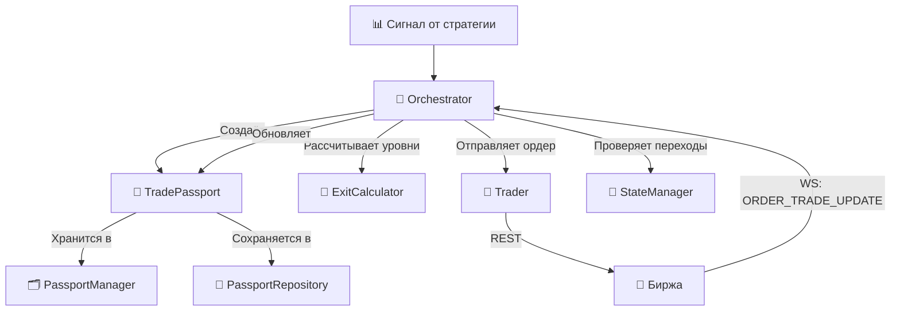

Отлично, продолжаем формирование Манифеста. Ниже представлен полный текст четвёртого файла — **`docs/03_TRADING_CORE.md`**. Это самый объёмный и важный документ, описывающий сердце бизнес-логики платформы. Скопируй его и сохрани в папку `docs/`.

---

# 📄 `docs/03_TRADING_CORE.md`

```markdown
# 🧠 Торговое Ядро (Trading Core)

Этот документ описывает модули, которые принимают решения, управляют состоянием сделок и исполняют команды. Это сердце платформы `PLAT_WALLS_NEW`.

---

## 🗺️ Общая схема взаимодействия



---

## 📖 1. `trading/passport.py` — Цифровой Паспорт Сделки (SSOT)

### 📌 Назначение
Полный цифровой след конкретной торговой операции от момента генерации сигнала до закрытия позиции. Это **единый источник правды (SSOT)** для платформы. Все модули читают и обновляют данные сделки только через паспорт.

### 🏗️ Роль
**«Агрегат» (в терминах DDD).** Паспорт не знает о внешнем мире (EventBus, биржа), но содержит всё, что нужно для понимания состояния сделки.

### 📦 Структура данных

| Группа | Поля | Назначение |
| :--- | :--- | :--- |
| **Идентификация** | `passport_id`, `symbol`, `status` | Уникальный ID (`PASS_YYYYMMDD_HHMMSS_<hex>`), инструмент, текущий статус |
| **Сигнал** | `signal_id`, `strategy`, `side`, `entry_price`, `confidence` | Исходные данные сигнала |
| **Уровни** | `sl_price`, `tp1_price`, `tp2_price` | Рассчитанные уровни защиты |
| **Позиция** | `position_size`, `position_entry_price` | Фактическое состояние позиции |
| **Ордера** | `orders: List[Dict]` | Список всех ордеров, связанных со сделкой |
| **Время** | `created_at`, `updated_at`, `closed_at` | Временные метки (UTC, ISO) |
| **История** | `timeline: List[Dict]` | Append-only лог событий паспорта |
| **Результат** | `exit_reason`, `exit_price`, `gross_pnl`, `commission`, `net_pnl` | Финансовый итог сделки |

### 🔗 Публичные контракты

| Метод | Назначение |
| :--- | :--- |
| `transition_to(new_status, reason)` | Меняет статус, обновляет `timeline`. **Не проверяет допустимость** (делегировано `StateManager`) |
| `add_timeline_event(event_type, details)` | Добавляет произвольное событие в историю |
| `add_order(order)` | Добавляет ордер в список `orders` |
| `close(exit_reason, exit_price, gross_pnl, commission)` | Закрывает паспорт, вычисляет `net_pnl = gross_pnl - commission` |
| `to_dict()` | Сериализует паспорт в словарь (для сохранения на диск) |

### ⚙️ Паттерны поведения
1. **Автоматическое обновление `updated_at`** при любом изменении.
2. **Append-only timeline** — история только дополняется, не изменяется (immutable audit log).
3. **Генерация ID:** `PASS_<дата_время>_<6_символов_uuid>` — человекочитаемость + уникальность.
4. **Делегирование валидации** — паспорт не проверяет допустимость переходов и корректность данных.

### ⚠️ Техдолг
1. 🟡 **Импорт `datetime` внутри метода** `add_timeline_event()` — антипаттерн.
2. 🟡 **`orders` хранит сырые словари**, а не объекты `Order` из `types.py`. Нет типобезопасности.
3. 🟡 **Нет защиты от двойного закрытия** через `close()`.
4. 🟡 **Нет методов `update_position()` и `update_order()`** — поля модифицируются напрямую извне.
5. 🟡 **`signal_id` может быть пустым** — нет валидации при создании.

### 💡 Edge-cases
- **Частичное исполнение (Partial Fill):** нет метода для обновления `position_size` и `position_entry_price`; Orchestrator обновляет поля напрямую.
- **Перенос SL в безубыток:** нет метода `move_sl_to_breakeven()`; поле `sl_price` модифицируется напрямую.

---

## 🚦 2. `trading/state_manager.py` — Регулировщик (Конечный Автомат)

### 📌 Назначение
Контролирует **допустимые переходы** между статусами паспорта. Гарантирует, что паспорт не может перейти в недопустимое состояние. Это **страж консистентности** данных.

### 🗺️ Карта разрешённых переходов

```
SIGNAL_GENERATED ──┬──► ORDER_SENT
                   ├──► CANCELED
                   └──► CLOSED

ORDER_SENT ────────┬──► ORDER_ACK
                   ├──► OPEN (MARKET может сразу стать OPEN)
                   ├──► CANCELED
                   └──► FAILED

ORDER_ACK ─────────┬──► LIMIT_ON_BOOK
                   ├──► OPEN
                   ├──► CANCELED
                   └──► FAILED

LIMIT_ON_BOOK ─────┬──► OPEN
                   ├──► CANCELED
                   └──► FAILED

OPEN ──────────────┬──► PARTIAL_CLOSE
                   ├──► CLOSING
                   ├──► CLOSED
                   └──► CANCELED

PARTIAL_CLOSE ─────┬──► OPEN (возврат!)
                   ├──► CLOSING
                   └──► CLOSED

CLOSING ───────────┬──► CLOSED
                   └──► FAILED

CANCELED ──────────► (терминальное)
CLOSED ────────────► (терминальное)
FAILED ────────────► (терминальное)
```

### 🔗 Публичные контракты

| Метод | Назначение |
| :--- | :--- |
| `can_transition(current, new)` | Проверяет, разрешён ли переход |
| `transition(passport, new_status, reason)` | Выполняет переход, если разрешён. Логирует в консоль с эмодзи |
| `handle_event(passport, event_type, event_data)` | Маппит событие на целевой статус и выполняет переход. **Напрямую модифицирует поля паспорта** (`position_size`, `exit_price`, `gross_pnl` и т.д.) |
| `sync_with_exchange(passport, exchange_status, position_size)` | Синхронизирует паспорт с биржей. Упрощённая логика: если позиции нет → закрыть; если позиция есть → открыть |

### 📨 Маппинг событий в `handle_event()`

| Событие | Целевой статус | Действие |
| :--- | :--- | :--- |
| `ORDER_SENT` | `ORDER_SENT` | — |
| `ORDER_ACK` | `ORDER_ACK` или `LIMIT_ON_BOOK` | В зависимости от типа ордера |
| `ORDER_FILLED` | `OPEN` | Обновляет `position_size`, `position_entry_price` |
| `ORDER_PARTIAL` | `OPEN` | Обновляет `position_size`, `position_entry_price` |
| `ORDER_CANCELED` | `CANCELED` | — |
| `ORDER_FAILED` | `FAILED` | — |
| `POSITION_CLOSED` | `CLOSED` | Обновляет `exit_price`, `gross_pnl`, `commission`, `net_pnl` |
| `POSITION_CLOSING` | `CLOSING` | — |
| `PARTIAL_CLOSE` | `PARTIAL_CLOSE` | — |

### ⚠️ Техдолг
1. 🔴 **`print()` вместо `JsonLogger`.** Переходы статусов не попадают в структурированный лог.
2. 🔴 **Нет обработки `UNKNOWN` статуса.** Он не включён в карту переходов. Если паспорт попадёт в `UNKNOWN`, он «застрянет».
3. 🟡 **Прямая модификация полей паспорта** в `handle_event()` — нарушение инкапсуляции.
4. 🟡 **Молчаливое отклонение недопустимых переходов** без логирования.
5. 🟡 **Упрощённая `sync_with_exchange()`.** Не обрабатывает частичное исполнение, рассинхрон по цене входа, рассинхрон по ордерам.

### 💡 Edge-cases
- **Гонка `ORDER_FILLED` и `POSITION_CLOSED`:** карта не разрешает `SIGNAL_GENERATED` → `CLOSED` напрямую (только через `ORDER_SENT`). Это защита от некорректной последовательности.
- **Частичное исполнение с последующей отменой:** карта разрешает `OPEN` → `CANCELED`, но позиция уже частично открыта. Возможно, нужен переход через `PARTIAL_CLOSE`.
- **`PARTIAL_CLOSE` → `OPEN` → `PARTIAL_CLOSE`:** карта разрешает циклические переходы для сценария TP1 → TP2. Нужно убедиться, что `position_size` корректно уменьшается.

---

## 🗂️ 3. `trading/passport_manager.py` — Картотека (In-memory кэш)

### 📌 Назначение
Кэш всех паспортов в памяти. Отвечает **исключительно за CRUD-операции** и не содержит бизнес-логики.

### 🔗 Публичные контракты

| Метод | Назначение |
| :--- | :--- |
| `create(symbol, signal_id, strategy, side, entry_price, confidence)` | Создаёт паспорт со статусом `SIGNAL_GENERATED`. Уровни и позиция инициализируются нулями |
| `get(passport_id)` | Возвращает паспорт или `None` |
| `get_all()` | Все паспорта (включая закрытые) |
| `get_active()` | Паспорта, которые **не являются** `CLOSED` или `CANCELED`. ⚠️ **`FAILED` не исключается!** |
| `get_by_symbol(symbol)` | Все паспорта по символу |
| `get_active_by_symbol(symbol)` | **Первый найденный** активный паспорт по символу |
| `is_symbol_busy(symbol)` | Проверка, есть ли активный паспорт по символу. **Ключевая защита** от нескольких позиций |
| `update(passport)` | Перезаписывает паспорт в кэше |
| `remove(passport_id)` | Удаляет паспорт из кэша |

### ⚙️ Паттерны поведения
1. **Хранение по ссылке:** все модули работают с одним объектом паспорта.
2. **Фильтрация по статусу:** активные = не `CLOSED` и не `CANCELED`.
3. **Один активный паспорт на символ:** `get_active_by_symbol()` возвращает первый найденный.

### ⚠️ Техдолг
1. 🔴 **`FAILED` не исключается из активных.** Если паспорт упал в `FAILED`, символ остаётся «занятым».
2. 🟡 **Нет ограничения на размер кэша.** Паспорта накапливаются бесконечно.
3. 🟡 **Нет метода `clear()`** для полной очистки.
4. 🟡 **`update()` технически избыточен** — паспорта хранятся по ссылке.
5. 🟡 **Нет логирования операций.**

### 💡 Edge-cases
- **FAILED-паспорт блокирует символ:** платформа не может открыть новую позицию, пока FAILED-паспорт не будет удалён или обработан `RecoveryManager`.
- **Удаление паспорта без сохранения:** если `remove()` вызван до `repository.save()`, данные теряются.

---

## 💾 4. `trading/passport_repository.py` — Архив (Персистентность)

### 📌 Назначение
Слой долговременного хранения паспортов на диске. Сериализует паспорт в JSON и десериализует обратно.

### 🔗 Публичные контракты

| Метод | Назначение |
| :--- | :--- |
| `save(passport)` | Сериализует паспорт через `to_dict()` → `json.dump()` с `indent=2` |
| `load(passport_id)` | Загружает паспорт с диска. Возвращает `TradePassport` или `None` |
| `delete(passport_id)` | Удаляет файл паспорта |

### ⚙️ Паттерны поведения
1. **Полная перезапись файла** при каждом `save()`.
2. **Имя файла = ID паспорта:** `passport_{passport_id}.json`.
3. **JSON-формат:** человекочитаемость и совместимость.

### ⚠️ Техдолг
1. 🔴 **Отсутствие атомарности записи.** Если платформа упадёт во время `save()`, файл останется битым. **Решение:** писать во временный файл, затем атомарно переименовывать.
2. 🔴 **Нет обработки ошибок.** `save()`, `load()`, `delete()` не обёрнуты в `try/except`.
3. 🟡 **`load()` использует распаковку `**data`.** Риск `TypeError` при несовместимости версий.
4. 🟡 **Нет валидации данных при загрузке.**
5. 🟡 **Нет методов `list_all()` и `load_all()`.** `RecoveryManager` сам сканирует директорию через `Path.glob()`.
6. 🟡 **Нет ротации/архивации.** Файлы накапливаются бесконечно.

### 💡 Edge-cases
- **Аварийная остановка во время `save()`:** файл остаётся битым, данные теряются.
- **Рассинхрон памяти и диска:** если платформа упала между обновлением в памяти и `save()`, на диске будет старая версия.

---

## 🧠 5. `trading/orchestrator.py` — Мозг Платформы

### 📌 Назначение
Главный управляющий модуль. Принимает **все ключевые решения** о том, что делать с сигналами, ордерами и паспортами. Координирует работу всех остальных модулей.

### 📡 Подписка на события

| Событие | Обработчик | Что делает |
| :--- | :--- | :--- |
| `SIGNAL_GENERATED` | `_on_signal` | Создаёт паспорт, рассчитывает уровни, отправляет ордер |
| `ORDER_TRADE_UPDATE` | `_on_order_update` | Обновляет паспорт, обрабатывает TP1/TP2/SL |
| `ACCOUNT_UPDATE` | `_on_account_update` | Синхронизирует с биржей, закрывает паспорт при нулевой позиции |
| `POSITION_CLOSED` | `_on_position_closed` | Закрывает паспорт |
| `SYNC_REQUEST` | `_on_sync_request` | Запрашивает позицию с биржи и синхронизирует паспорт |
| `TTL_EXPIRED` | `_on_ttl_expired` | Конвертирует лимитный ордер в рыночный или отменяет |

### 📨 Публикуемые события

| Событие | Когда публикуется |
| :--- | :--- |
| `SIGNAL_REJECTED` | Сигнал отклонён (символ занят) |
| `PASSPORT_CREATED` | Создан паспорт с лимитным ордером (для LifecycleManager) |
| `POSITION_OPENED` | Позиция открыта (для RiskManager) |
| `TP1_FILLED` | Сработал TP1 (частичное закрытие) |
| `POSITION_CLOSED` | Позиция закрыта |
| `POSITION_CLOSING` | Начато закрытие позиции |

### 🔧 Ключевые обработчики

#### `_on_signal()`
1. **Защита от спама:** cooldown 10 секунд на символ.
2. **Проверка занятости символа:** `is_symbol_busy()`.
3. **Создание паспорта:** `PassportManager.create()`.
4. **Расчёт уровней:** `Trader.calculate_exit_levels()` с `atr_value` из конфига.
5. **Сохранение паспорта:** `repository.save()`.
6. **Отправка ордера:** `Trader.execute_order()`.
7. **Обработка результата:** `ORDER_SENT` или `FAILED`.
8. **Публикация `PASSPORT_CREATED`** для лимитных ордеров.

#### `_on_order_update()`
1. **Поиск паспорта** по `client_order_id` (линейный поиск по всем паспортам).
2. **Обработка TP1:** уменьшение `position_size`, публикация `TP1_FILLED`. ⚠️ **Нет перевода в `PARTIAL_CLOSE`!**
3. **Обработка TP2:** `POSITION_CLOSED` с причиной `TP2_HIT`.
4. **Обработка SL:** `POSITION_CLOSED` с причиной `SL_HIT`.
5. **Обработка MARKET-ордеров:** обновление `position_size` и `position_entry_price`.
6. **Маппинг статусов Binance на события StateManager.**
7. **Публикация `POSITION_OPENED`** при открытии позиции.

#### `_on_account_update()`
1. **Если позиция = 0:** отмена всех ордеров через `RiskManager`, закрытие паспорта.
2. **Если позиция ≠ 0:** синхронизация через `StateManager.sync_with_exchange()`.

#### `_on_ttl_expired()`
1. Проверка статуса `LIMIT_ON_BOOK`.
2. Действие из конфига: `convert_to_market` или отмена.
3. **Конвертация:** отмена лимитного ордера → отправка рыночного.
4. **Отмена:** только отмена лимитного ордера.

### ⚠️ Техдолг

#### 🔴 Критический
1. **ATR берётся из конфига как статическое значение** (`config['trading']['atr_value']`). Уровни SL/TP не адаптируются к волатильности.
2. **`gross_pnl` и `commission` всегда 0.** PnL не рассчитывается. Нужно запрашивать историю сделок с биржи.
3. **Отладочные `print()`** в `_on_account_update()`.
4. **`lot_size = 7.0` по умолчанию** — магическое число.

#### 🟡 Важный
5. **Обработка TP1/TP2/SL по префиксам `client_order_id`** (`TP1_`, `TP2_`, `SL_`) — хрупкая схема.
6. **Линейный поиск паспорта по `client_order_id`** — O(n×m) сложность.
7. **Нет перевода в `PARTIAL_CLOSE` при TP1.**
8. **Нет проверки результата отмены ордера в `_on_ttl_expired()`.**
9. **Прямая модификация полей паспорта.**
10. **`_signal_cooldown` захардкожен** (10 секунд).
11. **`close_position()` не отменяет защитные ордера.**

### 💡 Edge-cases
- **Гонка между TP1 и ACCOUNT_UPDATE:** возможна, если между обработками есть `await`.
- **Гонка между TTL_EXPIRED и ORDER_FILLED:** `_on_ttl_expired()` проверяет статус `LIMIT_ON_BOOK`, но если статус ещё не обновился, возможна гонка.
- **Платформа упала между отправкой ордера и получением подтверждения:** RecoveryManager должен это обнаружить.
- **Несколько сигналов по одному символу одновременно:** второй сигнал отклоняется через `is_symbol_busy()`.

---

## 👐 6. `trading/trader.py` — Руки Платформы

### 📌 Назначение
Исполнительный модуль, который **отправляет ордера на биржу и возвращает результат**. Не принимает решений, не работает с паспортами.

### 🔗 Публичные контракты

| Метод | Назначение |
| :--- | :--- |
| `execute_order(symbol, side, quantity, order_type, ...)` | Отправка ордера. Поддерживает `market`, `limit`, `stop_market`, `stop_limit` |
| `close_position(symbol, quantity, exit_reason, exit_price)` | Закрытие позиции рыночным ордером с `reduce_only=True` |
| `get_position_from_exchange(symbol)` | Запрос позиции через REST |
| `get_order_status(symbol, order_id)` | ⚠️ **ВРЕМЕННО ОТКЛЮЧЁН** — всегда возвращает `None` |
| `cancel_order(symbol, order_id)` | Отмена ордера через REST |
| `calculate_exit_levels(side, entry_price, atr_value)` | Делегирование в `ExitCalculator` |
| `stop()` | Остановка трейдера |

### ⚙️ Паттерны поведения
1. **Унифицированный формат ответа:** все методы возвращают словарь с `success`, `order_id`, `client_order_id`, `status`, `error`.
2. **Защита от некорректных параметров:** проверка наличия `limit_price` для лимитных ордеров, `stop_price` для стоп-ордеров.
3. **Обработка исключений:** любой exception преобразуется в `{'success': False, 'error': str(e)}`.
4. **Режим хеджирования:** `position_side='LONG'/'SHORT'`.
5. **Определение стороны при закрытии:** `close_position()` запрашивает позицию с биржи для определения стороны.

### ⚠️ Техдолг

#### 🔴 Критический
1. **`get_order_status()` временно отключён.** RecoveryManager не может проверить статус ордера.
2. **`ws_adapter` и `event_bus` передаются, но не используются.** Все операции идут через REST.

#### 🟡 Важный
3. **`_opened_at` и `_get_limit_price()` не используются.** Мёртвый код.
4. **Импорт `ExitCalculator` внутри конструктора** — антипаттерн.
5. **Нет retry-логики.**
6. **Нет валидации `quantity`** (минимальный размер, точность).
7. **Нет обработки rate limits.**
8. **`client_order_id` в `close_position()` может быть не уникальным.**
9. **`reduce_only=False` по умолчанию** в `execute_order()`.

### 💡 Edge-cases
- **REST-запрос падает по таймауту:** позиция могла быть открыта на бирже, но платформа считает, что ордер не отправлен.
- **`close_position()` не может определить сторону:** если запрос позиции не удался, используется сторона по умолчанию (`long`). Может привести к открытию новой позиции вместо закрытия.

---

## 📐 7. `trading/exit_calculator.py` — Математик

### 📌 Назначение
Рассчитывает уровни выхода (SL, TP1, TP2) на основе **ATR (Average True Range)**. Чистая функция без побочных эффектов.

### 🔗 Публичные контракты

| Метод | Назначение |
| :--- | :--- |
| `calculate(side, entry_price, atr_value)` | Возвращает `{'sl_price', 'tp1_price', 'tp2_price'}` |

### ⚙️ Логика расчёта

**Для LONG:**
```
SL  = entry_price - (ATR × atr_multiplier_sl)
TP1 = entry_price + (ATR × atr_multiplier_tp1)
TP2 = entry_price + (ATR × atr_multiplier_tp2)
```

**Для SHORT:**
```
SL  = entry_price + (ATR × atr_multiplier_sl)
TP1 = entry_price - (ATR × atr_multiplier_tp1)
TP2 = entry_price - (ATR × atr_multiplier_tp2)
```

### 📊 Соотношение Risk/Reward

| Уровень | Множитель ATR | R:R к SL |
| :--- | :--- | :--- |
| SL | `atr_multiplier_sl` | 1.0 (база) |
| TP1 | `atr_multiplier_tp1` | `tp1_mult / sl_mult` |
| TP2 | `atr_multiplier_tp2` | `tp2_mult / sl_mult` |

### ⚠️ Техдолг

#### 🔴 Критический
1. **Fallback ATR = 0.5 — магическое число.** Для BTC с ценой 60000 ATR 0.5 — ничтожно мало.
2. **Округление до 4 знаков** — не учитывает tick size инструмента.

#### 🟡 Важный
3. **Нет валидации `side`.** Если передано не `'long'`/`'short'`, код пойдёт в ветку `else` (short).
4. **Нет минимальных/максимальных ограничений.**
5. **Нет учёта комиссии и проскальзывания.**
6. **ATR передаётся как параметр, но не рассчитывается здесь.** Нужно уточнить источник ATR.

### 💡 Edge-cases
- **ATR = 0:** fallback на 0.5. Уровни будут некорректными.
- **Очень высокая волатильность:** уровни могут улететь очень далеко.
- **Округление нарушает порядок TP1/TP2:** теоретически возможно при очень малом ATR.

---

## ⚠️ Сводка критических проблем Trading Core

| # | Проблема | Модуль | Приоритет |
| :--- | :--- | :--- | :--- |
| 1 | ATR статический из конфига | `Orchestrator`, `ExitCalculator` | 🔴 High |
| 2 | PnL всегда 0 | `Orchestrator`, `StateManager` | 🔴 High |
| 3 | `get_order_status()` отключён | `Trader` | 🔴 High |
| 4 | `FAILED` не исключается из активных | `PassportManager` | 🔴 High |
| 5 | Нет атомарности записи паспорта | `PassportRepository` | 🔴 High |
| 6 | Нет обработки `UNKNOWN` статуса | `StateManager` | 🔴 High |
| 7 | Нет перевода в `PARTIAL_CLOSE` при TP1 | `Orchestrator` | 🟡 Medium |
| 8 | Отладочные `print()` | `Orchestrator`, `StateManager` | 🟡 Medium |
| 9 | Прямая модификация полей паспорта | `StateManager`, `Orchestrator` | 🟡 Medium |
| 10 | Линейный поиск паспорта по `client_order_id` | `Orchestrator` | 🟡 Medium |
| 11 | Хрупкая схема `TP1_`/`TP2_`/`SL_` | `Orchestrator` | 🟡 Medium |
| 12 | `orders` хранит сырые словари | `Passport` | 🟢 Low |
| 13 | Нет защиты от двойного закрытия | `Passport` | 🟢 Low |

---
*Конец документа `03_TRADING_CORE.md`*
```

---

### 🎯 Что дальше?

Следующий блок — **Защита и Восстановление (Risk & Lifecycle)**. 

Предлагаю выдать **`docs/04_RISK_LIFECYCLE.md`**, куда войдут:
- `RiskManager` — Щит (защитные ордера)
- `LifecycleManager` — Часовщик (TTL)
- `RecoveryManager` — Реаниматолог (восстановление после сбоев)

**Готов выдать `docs/04_RISK_LIFECYCLE.md`? Скажи "Дальше", и я сгенерирую его!** 🚀