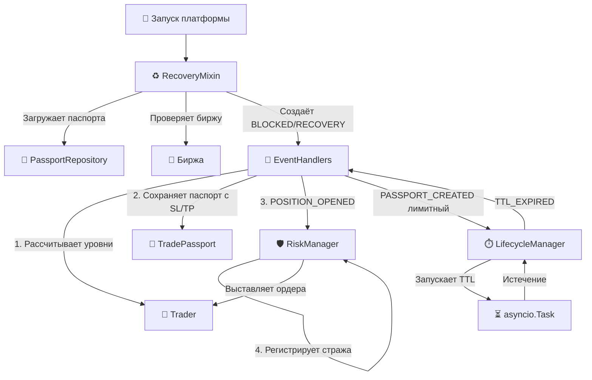

# 🛡️ Защита и Восстановление (Risk & Lifecycle) — v2.0

Этот документ описывает модули, отвечающие за сохранность капитала, управление временем жизни ордеров и восстановление платформы после сбоев.

**Версия:** 2.0 (Обновлено после изменения роли RiskManager и переноса RecoveryManager в миксин)

---

## 🗺️ Общая схема взаимодействия

---

## 🛡️ 1. `trading/risk_manager.py` — Щит (v2.0)

###  Назначение
Управляет защитой открытой позиции. Выставляет на биржу ордера TP1, TP2 и SL, а также отслеживает их исполнение.

###  Архитектурный сдвиг v2.0: От Калькулятора к Стражу
Ранее `RiskManager` сам рассчитывал уровни SL/TP. В версии 2.0 ответственность разделена:
1. **EventHandlers** запрашивает у `Trader` расчет уровней (`calculate_exit_levels`) и **сразу записывает их в паспорт** до публикации события.
2. **RiskManager** получает событие `POSITION_OPENED`, проверяет, что уровни уже проставлены (`sl_price != 0`), и регистрирует "стража" (выставляет ордера на биржу).

### 🔗 Публичные контракты
| Метод | Назначение |
| :--- | :--- |
| `_on_position_opened(event)` | Реагирует на открытие позиции. Если уровни = 0, логирует `levels_not_set` и выходит. Иначе вызывает `_register_guard()`. |
| `_register_guard(passport)` | Выставляет TP1, TP2, SL через `Trader`. Запоминает ID защитных ордеров. |
| `_on_price_update(event)` | Обновляет текущую цену для внутреннего мониторинга. |
| `_on_account_update(event)` | Реагирует на изменение позиции (частичное закрытие, полный выход). |
| `_on_position_closed(event)` | Снимает стража, отменяет неисполненные защитные ордера. |

### ⚠️ Техдолг
- 🔴 **Перенос SL в безубыток не реализован.** В документации заявлено, что при срабатывании TP1 SL должен двигаться в точку входа. В коде этого нет.
- 🟡 **Внутренний стоп vs Биржевой.** Если биржевой SL не исполнился (например, гэп), внутренний стоп должен принудительно закрыть позицию через REST. Логика требует проверки.
-  **Частичное исполнение.** Если TP1 закрыл 50%, нужно пересчитывать объем для оставшегося SL и TP2. Сейчас это работает не всегда корректно.

---

## ⏱️ 2. `trading/lifecycle_manager.py` — Часовщик

### 📌 Назначение
Следит за временем жизни (TTL) лимитных входных ордеров. Если ордер не исполнился за заданное время, он отменяется или конвертируется в рыночный.

### ⚙️ Логика работы
1. **Подписка на `PASSPORT_CREATED`:** Если тип ордера `limit`, запускается таймер на `ttl_seconds` (по умолчанию 300 сек).
2. **Подписка на `ORDER_FILLED` / `ORDER_CANCELED`:** Таймер отменяется, так как ордер больше не актуален.
3. **Срабатывание `TTL_EXPIRED`:** Публикует событие в шину. `EventHandlers` ловит его и либо отменяет ордер, либо отправляет рыночный (в зависимости от конфига `ttl_action`).

### ⚠️ Техдолг и Edge-cases
- 🔴 **Гонка между TTL_EXPIRED и ORDER_FILLED.** Если TTL истек, но событие об исполнении еще не дошло по WS, платформа может отменить уже исполненный ордер.
  - *Защита:* Проверка статуса `LIMIT_ON_BOOK` перед отменой.
-  **Потеря таймеров при краше.** Если платформа упадет, таймеры в памяти исчезнут. При восстановлении нужно вычислять оставшийся TTL как `ttl_seconds - (now - order_created_at)`.
- 🟡 **Словарь `_timers` хранит только один таймер на паспорт.** Если стратегия создаст несколько лимитных ордеров, второй таймер перезапишет первый.
- 🟡 **SL не попадает под TTL.** Это правильное поведение (стоп должен жить до закрытия позиции), но требует явного разделения типов ордеров в коде.

---

## ♻️ 3. `trading/recovery.py` — Реаниматолог (RecoveryMixin, v2.0)

### 📌 Назначение
Восстанавливает состояние платформы после перезапуска. **В версии 2.0** вынесен из отдельного класса `RecoveryManager` в миксин `RecoveryMixin`, который наследуется `Orchestrator`.

###  Ключевой метод: `perform_startup_recovery(symbol)`

**Алгоритм восстановления:**

1. **Проверка локального состояния:** Если в `PassportManager` есть активный паспорт, запрашиваем позицию с биржи и синхронизируем размер.
2. **Запрос позиции через REST:** До 3 попыток с интервалом 5 секунд.
3. **Критическая защита (REST недоступен):** 
   - Создается паспорт `BLOCKED_{symbol}_{timestamp}`.
   - **Критично:** Паспорт регистрируется в `passport_manager._passports` **до** сохранения на диск. Это гарантирует, что `is_symbol_busy()` вернет `True` и заблокирует торговлю.
4. **Позиция найдена (Orphan Position):**
   - Создается паспорт `RECOVERY_{symbol}_{timestamp}`.
   - Явно рассчитываются уровни SL/TP через `trader.calculate_exit_levels()`.
   - Публикуется `POSITION_OPENED` для регистрации стража в RiskManager.

### 📋 Сценарии восстановления

| Сценарий | Условие | Действие |
| :--- | :--- | :--- |
| **A** | Паспорт `OPEN`, позиции на бирже нет | Закрыть паспорт с причиной `EXTERNAL_CLOSE` |
| **B** | Паспорт `ORDER_SENT`/`ACK`/`LIMIT`, ордер `FILLED` | Перевести в `OPEN`, обновить размер и цену входа |
| **B2** | Паспорт `ORDER_SENT`/`ACK`/`LIMIT`, ордер отменен/нет | Перевести в `CANCELED`, освободить символ |
| **C** | Паспорт `OPEN`, позиция есть | Подтвердить, синхронизировать размер |
| **D** | Паспорт `CLOSED`, позиция есть | Переоткрыть (создать Recovery паспорт) |

### ️ Техдолг
- 🟡 **Старый `RecoveryManager`** (файл `recovery_manager.py`) всё ещё существует в проекте, но не используется. Нужно удалить.
- 🟡 **Нет восстановления TTL-таймеров.** При рестарте лимитные ордера теряют свой таймер и могут висеть бесконечно.
- 🟡 **Нет восстановления защитных ордеров.** Если TP/SL не успели выставиться до краша, Recovery их не выставит.

---

##  Сводка критических проблем Risk & Lifecycle (v2.0)

| # | Проблема | Модуль | Приоритет | Статус |
| :--- | :--- | :--- | :--- | :--- |
| 1 | Перенос SL в безубыток не реализован | RiskManager | 🔴 High | ⏳ Открыт |
| 2 | Гонка между TTL_EXPIRED и ORDER_FILLED | LifecycleManager | 🔴 High | ⏳ Открыт |
| 3 | Потеря таймеров и защитных ордеров при краше | Lifecycle / Recovery | 🔴 High | ⏳ Открыт |
| 4 | Мёртвый файл `recovery_manager.py` | trading/ |  Low | ⏳ Открыт |
| 5 | `_timers` хранит только один таймер на паспорт | LifecycleManager |  Medium | ⏳ Открыт |

### ✅ Решено в v2.0:
- **Разделение ответственности:** RiskManager больше не считает уровни, он только выставляет ордера на биржу.
- **Блокировка при старте:** `BLOCKED` паспорт теперь корректно регистрируется в памяти, предотвращая гонки состояний.
- **Явный расчет уровней при Recovery:** Восстановленные позиции сразу получают SL/TP.

---

*Конец документа `04_RISK_LIFECYCLE.md` v2.0*

---

Готов перейти к следующему файлу — **`docs/05_STRATEGIES_AND_MAIN.md`**? Скажи "Дальше", и я сгенерирую его с учетом всех наших исправлений! 