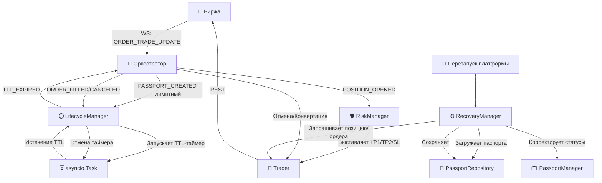
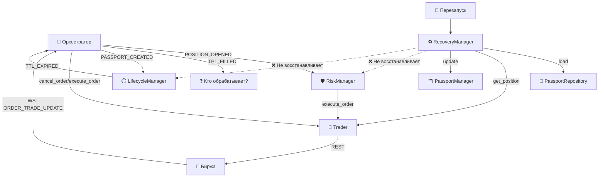

Отлично, продолжаем формирование Манифеста. Ниже представлен полный текст пятого файла — **`docs/04_RISK_LIFECYCLE.md`**. Скопируй его и сохрани в папку `docs/`.

---

# 📄 `docs/04_RISK_LIFECYCLE.md`

```markdown
# 🛡️ Защита, Жизненный Цикл и Восстановление

Этот документ описывает три модуля, которые отвечают за **безопасность сделок**, **управление временем жизни ордеров** и **восстановление платформы после сбоев**. Это критически важные компоненты для устойчивости торговой системы.

---

## 🗺️ Общая схема взаимодействия



---

## 🛡️ 1. `trading/risk_manager.py` — Щит Платформы

### 📌 Назначение
Управляет защитными ордерами (Stop-Loss и Take-Profit) для открытых позиций. Работает в режиме **Exchange-Only**: SL и TP выставляются как **реальные лимитные ордера на бирже**, а не отслеживаются внутренне платформой.

### 🏗️ Роль в архитектуре
**«Щит» платформы.** Единственный модуль, который отвечает за выставку защитных ордеров. Не принимает решений о том, *когда* открывать или закрывать позиции (это делает Orchestrator), но гарантирует, что каждая открытая позиция **защищена** на бирже.

**Принцип Exchange-Only:**
- SL/TP — это реальные ордера на бирже, а не виртуальные уровни.
- Если платформа упадёт, защита **останется на бирже** и сработает автоматически.
- Это упрощает логику платформы, но создаёт зависимость от биржи.

### 🔗 Публичные контракты

| Метод | Назначение |
| :--- | :--- |
| `cancel_all_orders(passport)` | Отменяет все активные ордера (TP1, TP2, SL) по паспорту. Очищает список `passport.orders` |
| `stop()` | Логирует остановку модуля. **Не отменяет ордера** |

### 📡 Подписка на события

| Событие | Обработчик | Что делает |
| :--- | :--- | :--- |
| `POSITION_OPENED` | `_on_position_opened` | Выставляет TP1, TP2, SL на биржу |

> ⚠️ **Критический пробел:** RiskManager **не подписан** на события срабатывания TP1 (`TP1_FILLED`), TP2, SL. Логика переноса SL в безубыток, заявленная в описании, **не реализована** в этом модуле.

### ⚙️ Логика выставления ордеров (`_place_risk_orders`)

**Определение стороны:**
- Если позиция `short` → TP/SL выставляются на стороне `long` (и наоборот).

**TP1 (частичное закрытие):**
- Объём: **50% от позиции** (`quantity × 0.5`).
- Тип: лимитный ордер по цене `tp1_price`.
- Клиентский ID: `TP1_{passport_id}`.
- Минимальный объём: `>= 0.1` (иначе не выставляется).

**TP2 (полное закрытие):**
- Объём: **50% от позиции** (`quantity × 0.5`).
- Тип: лимитный ордер по цене `tp2_price`.
- Клиентский ID: `TP2_{passport_id}`.
- Минимальный объём: `>= 0.1`.

**Задержка перед SL:**
- `await asyncio.sleep(0.15)` — **150 миллисекунд** перед выставлением SL. Причина не документирована.

**SL (защита от убытков):**
- Объём: **100% от позиции** (`quantity`).
- Тип: лимитный ордер.
- **Корректировка цены:**
  - Для `long`: `sl_price - 0.01` (SL чуть ниже расчётного).
  - Для `short`: `sl_price + 0.01` (SL чуть выше расчётного).
- Клиентский ID: `SL_{passport_id}`.
- Минимальный объём: `>= 0.1`.

### ⚠️ Техдолг

#### 🔴 Критический
1. **`reduce_only=False` для TP/SL.** Все ордера выставляются без `reduce_only`. Это значит, что TP2 может исполниться как **открытие новой позиции**, если TP1 уже закрыл часть позиции.
   - **Риск:** на Binance futures лимитный ордер без `reduce_only` может увеличить позицию, а не только закрыть.
   - **Решение:** для TP/SL ордеров всегда передавать `reduce_only=True`.

2. **Нет метода переноса SL в безубыток.** В описании модуля заявлено: *«При срабатывании TP1 переносит SL в безубыток»*. Но в коде **нет метода** для этого (например, `move_sl_to_breakeven()`).
   - **Решение:** добавить метод или задокументировать, что перенос SL делает Orchestrator.

3. **Нет подписки на события срабатывания TP/SL.** RiskManager подписан только на `POSITION_OPENED`. Он **не слушает** `TP1_FILLED`, `TP2_FILLED`, `SL_FILLED`.
   - **Риск:** логика реакции на срабатывание защитных ордеров находится вне RiskManager, что нарушает принцип единой ответственности.
   - **Решение:** добавить подписку на события срабатывания TP/SL.

#### 🟡 Важный
4. **Отладочные `print()` в `cancel_all_orders`.** Засоряют консоль и не попадают в структурированный лог.
5. **Жёстко зашитое разделение TP1/TP2 по 50%.** Нет гибкости для разных стратегий (например, 30/70).
6. **Минимальный объём 0.1 захардкожен.** Для разных инструментов минимальный размер может отличаться.
7. **Корректировка цены SL на 0.01 — магическое число.** Может быть некорректно для инструментов с другим tick size.
8. **Задержка 150 мс перед SL — магическое число.** Причина не документирована.
9. **Нет повторной попытки при ошибке выставления.** Если `trader.execute_order()` вернул `success=False`, позиция остаётся без защиты.
10. **`cancel_all_orders` очищает историю ордеров.** `passport.orders = []` теряет историю для аудита.

### 💡 Edge-cases
- **TP1 сработал, но SL остался на полный объём.** Если цена развернётся, SL может закрыться на объём, превышающий оставшуюся позицию. Митигация: `reduce_only=True`.
- **SL не выставился из-за ошибки.** Позиция остаётся без защиты. Митигация: retry-логика или автоматическое закрытие позиции.
- **Частичное исполнение TP1.** SL выставлен на полный объём. Нужно уменьшить SL на исполненный объём TP1.
- **Рассинхрон паспорта и биржи.** Если ордер выставился на бирже, но не добавился в паспорт, при `cancel_all_orders()` этот ордер не будет отменён.

---

## ⏱️ 2. `trading/lifecycle_manager.py` — Часовщик (TTL)

### 📌 Назначение
Управляет **временем жизни (TTL — Time-To-Live)** лимитных ордеров. Запускает таймеры для лимитных заявок и, если ордер не исполнился в отведённое время, уведомляет Оркестратора для принятия решения (отмена, конвертация в рыночный ордер).

### 🏗️ Роль в архитектуре
**«Часовщик» платформы.** LifecycleManager **не принимает решений** о том, что делать с просроченным ордером. Он только **отслеживает время** и **уведомляет** Оркестратора. Это классическое разделение ответственности:
- **LifecycleManager** — знает, *когда* ордер просрочен.
- **Orchestrator** — решает, *что делать* с просроченным ордером.

### 🔗 Публичные контракты

| Метод | Назначение |
| :--- | :--- |
| `cancel_all_timers()` | Отменяет все активные TTL-таймеры |
| `stop()` | Отменяет все таймеры и логирует остановку |

### 📡 Подписка на события

| Событие | Обработчик | Что делает |
| :--- | :--- | :--- |
| `PASSPORT_CREATED` | `_on_passport_created` | Запускает TTL-таймер для лимитных ордеров |
| `ORDER_FILLED` | `_on_order_filled` | Отменяет таймер при исполнении ордера |
| `ORDER_CANCELED` | `_on_order_canceled` | Отменяет таймер при отмене ордера |
| `POSITION_CLOSED` | `_on_position_closed` | Отменяет таймер при закрытии позиции |

### 📨 Публикуемые события

| Событие | Когда публикуется |
| :--- | :--- |
| `TTL_EXPIRED` | По истечении TTL для лимитного ордера в статусе `LIMIT_ON_BOOK` |

### ⚙️ Логика работы TTL-таймера

**Запуск (`_on_passport_created`):**
1. Проверяется, что тип ордера — `limit`.
2. **Исключение SL-ордеров:** если `client_order_id` содержит `SL_`, таймер **не запускается**.
3. Проверяется валидность `passport_id`.
4. Запускается TTL-таймер через `_start_ttl_timer()`.

**Работа таймера (`_ttl_timer_task`):**
1. Ждёт TTL секунд (по умолчанию **300 секунд = 5 минут**).
2. Проверяет, что паспорт всё ещё существует.
3. Проверяет, что статус паспорта — `LIMIT_ON_BOOK`.
4. Если условия выполнены — публикует событие `TTL_EXPIRED` с данными:
   - `passport_id`, `symbol`, `entry_price`, `order_id` (берётся последний ордер из паспорта).
5. Таймер удаляется из словаря активных таймеров.

**Отмена таймера (`_cancel_timer`):**
- Вызывается при `ORDER_FILLED`, `ORDER_CANCELED`, `POSITION_CLOSED`.
- Отменяет asyncio-задачу и удаляет из словаря.

### ⚠️ Техдолг

#### 🟡 Важный
1. **TTL по умолчанию 300 секунд (5 минут).** Значение может быть слишком долгим или коротким для разных стратегий. Нужно документировать rationale или сделать настраиваемым per-strategy.
2. **`_get_order_id` берёт последний ордер.** Если TP/SL уже добавлены в паспорт, последний ордер может быть не входным лимитным ордером.
   - **Решение:** хранить `entry_order_id` отдельно или фильтровать по `client_order_id`.
3. **Нет обработки частичного исполнения (`PARTIALLY_FILLED`).** Таймер отменяется только при `ORDER_FILLED`.
4. **Нет повторного запуска таймера при пересоздании ордера.** Если Оркестратор отменяет просроченный ордер и создаёт новый, LifecycleManager не запускает новый таймер.
5. **Таймеры хранятся в памяти.** Если платформа упадёт, все таймеры потеряются. `RecoveryManager` должен восстанавливать TTL для активных лимитных ордеров.
6. **Нет валидации TTL из конфига.** Если `ttl_seconds <= 0`, таймер истечёт немедленно или не запустится.

### 💡 Edge-cases
- **Гонка между TTL_EXPIRED и ORDER_FILLED.** Если TTL истёк, но ордер уже исполнился (событие `ORDER_FILLED` ещё не пришло), возможна гонка. Защита: проверка статуса `LIMIT_ON_BOOK` перед публикацией.
- **SL не попадает под TTL.** Это правильно, так как SL должен жить до закрытия позиции.
- **Платформа упала, таймеры потеряны.** При восстановлении нужно вычислять оставшийся TTL как `ttl_seconds - (now - order_created_at)`.
- **Несколько лимитных ордеров по одному паспорту.** Словарь `_timers` хранит только один таймер на паспорт. Новый таймер не запустится.

---

## ♻️ 3. `trading/recovery_manager.py` — Реаниматолог

### 📌 Назначение
Восстанавливает состояние платформы после перезапуска или аварийной остановки. Загружает сохранённые паспорта с диска, сверяет их с **реальным состоянием на бирже** и корректирует статусы.

### 🏗️ Роль в архитектуре
**«Реаниматолог» платформы.** Прямой исполнитель принципа **«биржа = источник истины»**. Когда платформа перезапускается, она не может доверять своим внутренним паспортам. Единственный способ узнать правду — спросить биржу.

> ⚠️ **Критично:** В текущей версии `main.py` вызов `RecoveryManager.recover()` **закомментирован**. Восстановление **не активно** — платформа при перезапуске начинает с чистого листа.

### 🔗 Публичные контракты

| Метод | Назначение |
| :--- | :--- |
| `recover()` | Основной метод восстановления. Возвращает статистику: `total_passports`, `active_passports`, `synced`, `corrected`, `errors` |

### ⚙️ Алгоритм восстановления (`recover()`)

**Шаг 1: Загрузка всех паспортов с диска**
- Сканирует директорию `logs/` по маске `passport_*.json`.
- Для каждого файла вызывает `_load_passport_from_file()`.

> ⚠️ **Проблема:** RecoveryManager **сам сканирует директорию** через `Path.glob()`, вместо того чтобы использовать `PassportRepository`. Это дублирование логики.

**Шаг 2: Загрузка паспортов в кэш**
- Для каждого загруженного паспорта вызывает `passport_manager.update(passport)`.

**Шаг 3: Получение активных паспортов**
- Вызывает `passport_manager.get_active()`.
- Активными считаются паспорта, которые **не являются** `CLOSED` или `CANCELED`.
- ⚠️ **`FAILED` не исключается** из активных (см. техдолг `PassportManager`).

**Шаг 4: Синхронизация каждого активного паспорта**
- Для каждого активного паспорта вызывает `_sync_passport()`.
- Если возникла ошибка — логирует её и увеличивает счётчик `errors`.

**Шаг 5: Возврат статистики**
- Логирует итоги восстановления и возвращает словарь статистики.

### 🔄 Сценарии синхронизации (`_sync_passport`)

Для каждого активного паспорта RecoveryManager запрашивает с биржи:
1. **Текущую позицию** через `trader.get_position_from_exchange(symbol)`.
2. **Статус последнего ордера** через `trader.get_order_status(symbol, order_id)`. ⚠️ **Этот метод отключён в `trader.py`!**

| Сценарий | Условие | Действие |
| :--- | :--- | :--- |
| **A** | Паспорт `OPEN`, позиции нет | Закрыть паспорт с причиной `EXTERNAL_CLOSE`. ⚠️ `exit_price=0.0` |
| **B** | Паспорт `ORDER_SENT`/`ORDER_ACK`/`LIMIT_ON_BOOK`, ордер `FILLED` | Перевести в `OPEN`, обновить размер и цену входа |
| **B** | Паспорт `ORDER_SENT`/`ORDER_ACK`/`LIMIT_ON_BOOK`, ордер `CANCELED`/`EXPIRED` | Перевести в `CANCELED` |
| **B** | Паспорт `ORDER_SENT`/`ORDER_ACK`/`LIMIT_ON_BOOK`, ордера нет и позиции нет | Перевести в `CANCELED` |
| **C** | Паспорт `OPEN`, позиция есть | Подтвердить, ничего не менять |
| **D** | Паспорт `CLOSED`, позиция есть | Переоткрыть паспорт, обновить размер и цену входа |

### ⚠️ Техдолг

#### 🔴 Критический
1. **`recover()` закомментирован в `main.py`.** Восстановление **не активно**. При перезапуске платформа не знает про открытые позиции и выставленные ордера.
2. **Не обрабатываются статусы `PARTIAL_CLOSE`, `CLOSING`, `FAILED`, `UNKNOWN`, `SIGNAL_GENERATED`.** Если паспорт в одном из этих статусов, синхронизация ничего не сделает.
3. **Нет восстановления защитных ордеров (TP/SL).** RecoveryManager не проверяет наличие лимитных ордеров на бирже. При попытке выставить их заново может произойти дублирование.
4. **Нет восстановления TTL-таймеров.** Если паспорт в `LIMIT_ON_BOOK`, для него должен работать TTL-таймер. Но RecoveryManager не взаимодействует с `LifecycleManager`.
5. **`get_order_status()` отключён в `trader.py`.** RecoveryManager не может проверить статус ордера.

#### 🟡 Важный
6. **Нет публикации событий EventBus при корректировке.** Другие модули не узнают об изменениях.
7. **Прямая модификация полей паспорта** (`position_size`, `position_entry_price`).
8. **`close("EXTERNAL_CLOSE", 0.0)` — цена закрытия неизвестна.** PnL будет 0. Нужно запрашивать историю сделок с биржи.
9. **Дублирование логики сканирования директории.** Должно быть в `PassportRepository.list_all()`.

### 💡 Edge-cases
- **Платформа упала во время исполнения ордера.** Ордер мог исполниться на бирже, паспорт остался в `ORDER_SENT`. RecoveryManager обнаружит это (Сценарий B).
- **Платформа упала, позиция закрылась по SL.** Паспорт в `OPEN`, позиция закрыта. RecoveryManager закроет паспорт (Сценарий A), но PnL будет 0.
- **Платформа упала, кто-то вручную открыл позицию.** Паспорт в `CLOSED`, позиция есть. RecoveryManager переоткроет паспорт (Сценарий D). **Вопрос:** это корректное поведение?
- **На бирже остались лимитные ордера TP/SL.** RecoveryManager не проверяет их. RiskManager может выставить их заново → дублирование.
- **Повреждённый файл паспорта.** `_load_passport_from_file()` вернёт `None`. Паспорт не будет восстановлен, но позиция на бирже может быть открыта.

---

## 🔗 Связь модулей Risk & Lifecycle с платформой



---

## ⚠️ Сводка критических проблем Risk & Lifecycle

| # | Проблема | Модуль | Приоритет |
| :--- | :--- | :--- | :--- |
| 1 | `recover()` закомментирован в `main.py` | `RecoveryManager` | 🔴 High |
| 2 | `reduce_only=False` для TP/SL | `RiskManager` | 🔴 High |
| 3 | Нет метода переноса SL в безубыток | `RiskManager` | 🔴 High |
| 4 | Нет подписки на TP1_FILLED/TP2_FILLED/SL_FILLED | `RiskManager` | 🔴 High |
| 5 | `get_order_status()` отключён | `Trader` / `RecoveryManager` | 🔴 High |
| 6 | Не обрабатываются статусы PARTIAL_CLOSE, CLOSING, FAILED, UNKNOWN | `RecoveryManager` | 🔴 High |
| 7 | Нет восстановления защитных ордеров (TP/SL) | `RecoveryManager` | 🔴 High |
| 8 | Нет восстановления TTL-таймеров | `RecoveryManager` | 🔴 High |
| 9 | Отладочные `print()` в `cancel_all_orders` | `RiskManager` | 🟡 Medium |
| 10 | Жёстко зашитое разделение TP1/TP2 по 50% | `RiskManager` | 🟡 Medium |
| 11 | Минимальный объём 0.1 захардкожен | `RiskManager` | 🟡 Medium |
| 12 | Корректировка цены SL на 0.01 | `RiskManager` | 🟡 Medium |
| 13 | Задержка 150 мс перед SL | `RiskManager` | 🟡 Medium |
| 14 | `_get_order_id` берёт последний ордер | `LifecycleManager` | 🟡 Medium |
| 15 | Нет обработки PARTIALLY_FILLED | `LifecycleManager` | 🟡 Medium |
| 16 | Таймеры в памяти (теряются при краше) | `LifecycleManager` | 🟡 Medium |
| 17 | Нет публикации событий при корректировке | `RecoveryManager` | 🟡 Medium |
| 18 | `close("EXTERNAL_CLOSE", 0.0)` — цена неизвестна | `RecoveryManager` | 🟡 Medium |

---
*Конец документа `04_RISK_LIFECYCLE.md`*
```

---

### 🎯 Что дальше?

Следующий блок — **Стратегии и Точка Входа**. 

Предлагаю выдать **`docs/05_STRATEGIES_AND_MAIN.md`**, куда войдут:
- `strategies/base.py` — Базовый класс (контракт)
- `strategies/wall_fade.py` — Поиск стенок сопротивления (short)
- `strategies/absorption.py` — Дисбаланс объёмов (long)
- `strategies/breakout.py` — Пробой уровней (long/short)
- `main.py` — Дирижёр платформы (инициализация, основной цикл, маршрутизация событий)

**Готов выдать `docs/05_STRATEGIES_AND_MAIN.md`? Скажи "Дальше", и я сгенерирую его!** 🚀