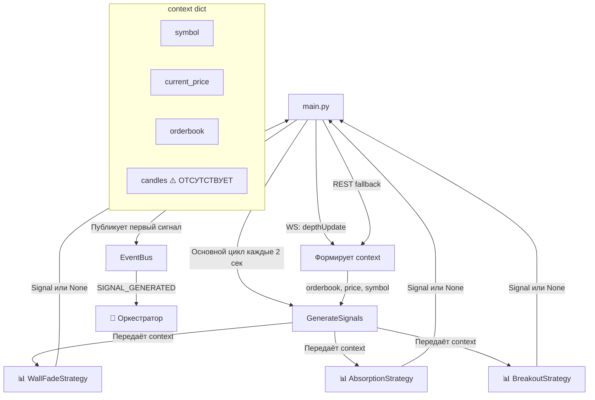

Отлично, продолжаем формирование Манифеста. Ниже представлен полный текст шестого файла — **`docs/05_STRATEGIES_AND_MAIN.md`**. Скопируй его и сохрани в папку `docs/`.

---

# 📄 `docs/05_STRATEGIES_AND_MAIN.md`

```markdown
# 📊 Стратегии и Точка Входа (Strategies & Main)

Этот документ описывает модули анализа рынка (стратегии) и главный файл инициализации платформы (`main.py`). Стратегии — это «аналитики», которые смотрят на рынок и предлагают идеи для входа. `main.py` — это «дирижёр», который собирает всё воедино и запускает процесс.

---

## 🗺️ Общая схема взаимодействия



---

## 📊 1. Стратегии (Strategies)

### 1.1. Общая архитектура стратегий

Все стратегии наследуются от `BaseStrategy` и реализуют единый контракт:

```python
class BaseStrategy:
    def __init__(self, name: str, config: Dict):
        self.name = name
        self.config = config
        self.enabled = config.get('enabled', False)
    
    def generate_signal(self, context: Dict[str, Any]) -> Optional[Signal]:
        raise NotImplementedError
```

**Принципы:**
- **Чистые функции:** стратегии не отправляют ордера, не публикуют события, не работают с паспортами.
- **Пассивность:** стратегии вызываются извне (из `main.py`), не подписываются на события.
- **Изоляция:** стратегии не знают про EventBus, Trader, Orchestrator.

**Место в цепочке:**
```
[main.py: основной цикл] → [Формирование context] → [strategy.generate_signal(context)] → [Signal или None] → [Публикация SIGNAL_GENERATED]
```

### 1.2. `strategies/base.py` — Базовый класс (контракт)

#### 📌 Назначение
Абстрактный базовый класс для всех торговых стратегий. Определяет единый интерфейс: получить контекст рынка → вернуть сигнал или `None`.

#### 🔗 Публичные контракты

| Метод | Назначение |
| :--- | :--- |
| `generate_signal(context)` | Анализирует рыночный контекст и возвращает `Signal` или `None` |

#### 📦 Ожидаемый формат `context`

| Ключ | Тип | Назначение |
| :--- | :--- | :--- |
| `symbol` | `str` | Торговый инструмент (например, `SOLUSDT`) |
| `current_price` | `float` | Текущая цена |
| `orderbook` | `Dict` | Стакан: `{'bids': [...], 'asks': [...]}` |
| `candles` | `List[Dict]` | История свечей (для Breakout) ⚠️ **не передаётся из main.py** |

#### 📦 Тип `Signal` (из `core/types.py`)

| Поле | Назначение |
| :--- | :--- |
| `signal_id` | Уникальный ID сигнала |
| `symbol` | Торговый инструмент |
| `side` | Направление сделки (`'long'` / `'short'`) |
| `entry_price` | Цена входа |
| `confidence` | Уверенность стратегии (0.0–1.0) |
| `strategy` | Имя стратегии |
| `metadata` | Произвольный словарь для дополнительных данных |

#### ⚠️ Техдолг
- 🟡 **Нет типизации `context`** — `Dict[str, Any]` без схемы.
- 🟡 **Нет документированного контракта** для `context`.
- 🟡 **Нет метода `stop()` или `cleanup()`** для стратегий с состоянием.

---

### 1.3. `strategies/wall_fade.py` — Поиск стенок сопротивления (short)

#### 📌 Назначение
Стратегия ищет в стакане крупные уровни сопротивления (**стенки на ask**) и генерирует сигнал на **вход в short от этого уровня**.

**Идея:** если на определённой цене стоит крупный объём на продажу (ask-стенка), это создаёт сопротивление. Цена, подойдя к этому уровню, может отскочить вниз.

#### 🏗️ Роль
**«Аналитик стакана».** Работает только с **текущим стаканом**, не использует историю свечей или индикаторы. Генерирует сигналы только на **short**.

#### ⚙️ Логика работы

1. **Проверка активности:** если `enabled=False` → `None`.
2. **Получение данных:** `orderbook`, `symbol`, `current_price` из context.
3. **Поиск стенки в asks:** перебираются уровни asks, ищется **первый** уровень с объёмом > `min_wall_volume`.
4. **Проверка расстояния:** `distance = |wall_price - current_price| / current_price × 100`. Если > `price_distance_pct` → `None`.
5. **Создание сигнала:** `side='short'`, `entry_price=wall_price`, `confidence=0.7`.

#### 📊 Пример работы

| Параметр | Значение |
| :--- | :--- |
| `current_price` | 100.0 USDT |
| `min_wall_volume` | 20.0 |
| `price_distance_pct` | 0.5% |
| Стакан asks | `[100.1, 5.0], [100.3, 25.0], [100.5, 50.0]` |

**Результат:** стенка найдена на 100.3 (объём 25 > 20). Расстояние 0.3% < 0.5% → сигнал на short от 100.3.

#### ⚠️ Техдолг
1. 🔴 **`min_confidence` читается, но не используется.**
2. 🔴 **`confidence` захардкожен 0.7** — не зависит от объёма стенки или расстояния.
3. 🟡 **Название «WallFade» не отражает логику** — нет анализа угасания стенки.
4. 🟡 **Берётся первая найденная стенка** — не самая близкая или самая большая.
5. 🟡 **Работает только на short** — нет long-сигналов (поиск стенок в bids).
6. 🟡 **`signal_id` может быть не уникальным.**

---

### 1.4. `strategies/absorption.py` — Дисбаланс объёмов (long)

#### 📌 Назначение
Стратегия детектирует **дисбаланс объёмов** в стакане и генерирует сигнал на **вход в long**, когда объём на покупку (bids) значительно превышает объём на продажу (asks).

**Идея:** если в стакане на уровнях покупки стоит существенно больше объёма, чем на уровнях продажи, это создаёт давление покупателей.

#### 🏗️ Роль
**«Аналитик дисбаланса».** Анализирует **соотношение суммарных объёмов** на ближайших уровнях стакана. Генерирует сигналы только на **long**.

#### ⚙️ Логика работы

1. **Проверка активности:** если `enabled=False` → `None`.
2. **Подсчёт объёмов:** `bid_volume = sum(bids[:3])`, `ask_volume = sum(asks[:3])`.
3. **Проверка дисбаланса:** если `bid_volume > ask_volume × 1.5` → сигнал на long.
4. **Создание сигнала:** `side='long'`, `entry_price=current_price`, `confidence=0.6`.

#### 📊 Пример работы

| Параметр | Значение |
| :--- | :--- |
| `current_price` | 100.0 USDT |
| Стакан bids | `[99.9, 10], [99.8, 15], [99.7, 20]` → `bid_volume = 45` |
| Стакан asks | `[100.1, 8], [100.2, 10], [100.3, 7]` → `ask_volume = 25` |

**Проверка:** `45 > 25 × 1.5 = 37.5` → ДА → сигнал на long.

#### ⚠️ Техдолг
1. 🔴 **`min_wall_volume` и `min_confidence` читаются, но НЕ используются.**
2. 🔴 **`confidence` захардкожен 0.6.**
3. 🔴 **Порог 1.5 захардкошен** — не настраивается через конфиг.
4. 🟡 **Работает только на long** — нет short-сигналов.
5. 🟡 **Глубина анализа (3 уровня) захардкошена.**
6. 🟡 **Нет обработки исключений** при парсинге объёмов.
7. 🟡 **Нет реального анализа «поглощения»** — просто сравнение объёмов.

---

### 1.5. `strategies/breakout.py` — Пробой уровней (long/short)

#### 📌 Назначение
Стратегия детектирует **пробой уровней поддержки и сопротивления** и генерирует сигналы на вход в направлении пробоя.

**Идея:** если цена пробивает локальный максимум при повышенном объёме — сигнал на long. Если пробивает локальный минимум при повышенном объёме — сигнал на short.

#### 🏗️ Роль
**«Аналитик свечей».** Работает с **историей свечей** (highs, lows, volumes). Генерирует сигналы на **long и short**.

#### ⚙️ Логика работы

1. **Проверка активности и данных:** если свечей нет или < `lookback_bars` → `None`.
2. **Извлечение данных:** highs, lows, closes из последних `lookback_bars` свечей.
3. **Расчёт уровней:** `resistance = max(highs)`, `support = min(lows)`.
4. **Проверка пробоя сопротивления (LONG):** если `current_price > resistance` и объём последних 5 свечей > среднего × 1.5 → сигнал на long.
5. **Проверка пробоя поддержки (SHORT):** аналогично для `current_price < support`.

#### 📊 Пример работы

| Параметр | Значение |
| :--- | :--- |
| `current_price` | 105.0 USDT |
| `lookback_bars` | 20 |
| Последние 20 свечей | max(highs) = 104.5, min(lows) = 98.0 |
| Объём последних 5 свечей | 150 |
| Средний объём за 20 свечей | 80 |

**Проверка пробоя сопротивления:** `105.0 > 104.5` → ДА. `150 > 80 × 1.5 = 120` → ДА → сигнал на long.

#### ⚠️ Техдолг

##### 🔴 Критический
1. **Стратегия не работает!** `main.py` **не передаёт `candles` в context**. Breakout всегда возвращает `None`.
   - **Решение:** добавить загрузку истории свечей в `main.py` или подписку на kline WS-стрим.

##### 🟡 Важный
2. **Три мёртвых параметра:** `min_volume`, `min_confidence`, `breakout_threshold` читаются, но не используются.
3. **`confidence` захардкожен 0.7.**
4. **Порог объёма 1.5 захардкошен.**
5. **Дублирование кода** для long и short.
6. **`closes` извлекаются, но не используются.**

---

### 1.6. Сравнение всех трёх стратегий

| Параметр | WallFade | Absorption | Breakout |
| :--- | :--- | :--- | :--- |
| **Направление** | Только short | Только long | Long и Short |
| **Источник данных** | Стакан (asks) | Стакан (bids/asks) | Свечи ⚠️ |
| **Логика** | Поиск крупной стенки | Дисбаланс объёмов | Пробой уровней + объём |
| **Entry price** | Цена стенки | Текущая цена | Текущая цена |
| **Confidence** | 0.7 | 0.6 | 0.7 |
| **Мёртвые параметры** | `min_confidence` | `min_wall_volume`, `min_confidence` | `min_volume`, `min_confidence`, `breakout_threshold` |
| **Обработка исключений** | Есть | Нет | Нет |
| **Состояние** | Нет | Нет | Нет |
| **Работает сейчас?** | ✅ Да | ❌ Отключена в конфиге | ❌ Нет свечей в context |

#### Общие проблемы всех стратегий:
1. **Мёртвые параметры** — во всех трёх стратегиях есть параметры, которые читаются из конфига, но не используются.
2. **Confidence захардкожен** — ни одна стратегия не рассчитывает уверенность динамически.
3. **Пороги захардкошены** — числовые пороги (1.5, 0.5 и т.д.) не настраиваются через конфиг.
4. **`signal_id` не уникален** — все стратегии формируют ID на основе цены/объёма.
5. **Нет валидации формата данных** — только WallFade имеет частичную защиту через `try/except`.

---

## 🔌 2. `main.py` — Дирижёр Платформы

### 📌 Назначение
Корневой модуль платформы. Отвечает за:
1. Загрузку конфигураций и секретов.
2. Инициализацию и связывание (wiring) всех компонентов.
3. Запуск WebSocket-соединений и фонового цикла продления ключей.
4. Основной торговый цикл (polling loop).
5. Обработку системных сигналов остановки (Ctrl+C).

### 🏗️ Роль в архитектуре
**«Дирижёр оркестра».** `main.py` не содержит бизнес-логики торговли. Его задача — создать инфраструктуру, настроить маршруты событий и запустить бесконечный цикл.

### 🔗 Порядок инициализации (Wiring)

| Шаг | Компонент | Зависимости |
| :--- | :--- | :--- |
| 1 | `ConfigLoader` | — |
| 2 | `JsonLogger` | — |
| 3 | `EventBus` | — |
| 4 | `PassportManager` | — |
| 5 | `PassportRepository` | — |
| 6 | `BinanceRestClient` | api_key, api_secret, base_url |
| 7 | `BinanceWsAdapter` | base_url |
| 8 | `ChannelRouter` | ws, rest |
| 9 | `StateManager` | passport_manager |
| 10 | `Orchestrator` | event_bus, passport_manager, passport_repository, state_manager, config, json_logger |
| 11 | `Trader` | symbol, rest_client, ws_adapter, event_bus, config |
| 12 | `LifecycleManager` | event_bus, passport_manager, config, json_logger |
| 13 | `RecoveryManager` | passport_manager, passport_repository, trader, config, json_logger |
| 14 | `RiskManager` | event_bus, passport_manager, trader, config, json_logger |
| 15 | `Orchestrator.register_trader()` | trader |
| 16 | `Orchestrator.set_risk_manager()` | risk_manager |
| 17 | Стратегии | config |

### ⚙️ Основной цикл (`_main_loop`)

Цикл работает бесконечно с интервалом в **2 секунды** (`await asyncio.sleep(2)`).

#### Шаг 1: Настройка WebSocket и маршрутизация событий

- Получает `listen_key` для User Data Stream.
- Подписывается на стакан (`depth`) и пользовательские данные (`user_data`).
- **Маршрутизация WS → EventBus:**
  - `ORDER_TRADE_UPDATE` (исполнение ордеров) → публикуется в EventBus.
  - `ACCOUNT_UPDATE` (изменение баланса/позиции) → публикуется в EventBus.
  - `depthUpdate` (стакан) → **НЕ публикуется в EventBus**, а сохраняется во внутренние переменные `self.ws_price` и `self.ws_orderbook`.
- Настраивает `on_ws_reconnect`: при обрыве связи обновляет `listen_key` и публикует `SYNC_REQUEST`.

#### Шаг 2: Торговый цикл (Polling)

Каждые 2 секунды:

1. **Получение цены:** берёт `self.ws_price`. Если WS ещё не дал цену, делает fallback-запрос стакана через REST.
2. **Получение позиции:** делает **REST-запрос** `get_position()`. ⚠️ **Критическая проблема!**
3. **Проверка занятости:** если `is_symbol_busy()` → `continue`.
4. **Формирование контекста:** собирает `context = {'symbol', 'current_price', 'orderbook'}`. ⚠️ **Нет `candles`!**
5. **Генерация сигналов:** вызывает `_generate_signals(context)`.
6. **Публикация:** если сигналы есть и символ свободен, публикует **только первый** сигнал (`signals[0]`).

### 🚨 КРИТИЧЕСКИЕ ПРОБЛЕМЫ `main.py`

#### 🔴 Проблема 1: Стратегия Breakout мертва (нет свечей)

В `_main_loop` формируется контекст для стратегий:
```python
context = {
    'symbol': self.symbol,
    'current_price': current_price,
    'orderbook': self.ws_orderbook,
}
```

**В контексте НЕТ поля `candles`!** BreakoutStrategy проверяет `if not candles: return None` и **никогда не сгенерирует сигнал**.

**Решение:** добавить в `main.py` фоновую задачу, которая запрашивает свечи через REST (или собирает их из WS kline-стрима) и добавляет `candles` в `context`.

#### 🔴 Проблема 2: Убийство REST-лимитов (опрос позиции каждые 2 сек)

В торговом цикле есть строка:
```python
position = await self.rest.get_position(self.symbol)
```

Этот запрос выполняется **каждые 2 секунды**, даже если позиция не менялась.
- Это 30 запросов в минуту, 1800 в час.
- Это нарушает принцип «WS — для данных, REST — для команд».
- При активной торговле это может привести к бану IP.

**Решение:** удалить `get_position()` из цикла. Платформа должна знать о позиции исключительно из событий `ACCOUNT_UPDATE`.

#### 🟡 Проблема 3: Обрабатывается только первый сигнал

```python
if signals:
    signal = signals[0]
    await self.bus.publish(...)
```

Если `WallFade` и `Absorption` одновременно генерируют сигналы, платформа возьмёт только первый, а второй проигнорирует.

**Решение:** публиковать все сигналы или добавить логику приоритетов.

#### 🟡 Проблема 4: Жесткий Sleep 2 секунды

`await asyncio.sleep(2)` означает, что платформа реагирует на рыночные изменения с задержкой до 2 секунд. Для стратегий на стакане это критично.

**Решение:** перейти на событийную модель (Event-Driven). Стратегии должны вызываться по событию `depthUpdate`.

#### 🟡 Проблема 5: `RecoveryManager` отключен

```python
#recovery_stats = await self.recovery_manager.recover()
```

Восстановление не работает. При перезапуске платформа «забывает» про открытые позиции и выставленные ордера.

#### 🟡 Проблема 6: Отсутствие закрытия WebSocket при остановке

В методе `stop()` закрывается REST-клиент и JsonLogger, но **нет явного закрытия WebSocket-соединения**.

#### 🟡 Проблема 7: Обработчик переподключения WS

```python
self.ws._on_reconnect = on_ws_reconnect
```

Прямое присваивание приватному полю `_on_reconnect` — это хак. Должен быть публичный метод `set_on_reconnect_callback()`.

---

## 📋 Сводка критических проблем Стратегий и Main

| # | Проблема | Модуль | Приоритет |
| :--- | :--- | :--- | :--- |
| 1 | Нет `candles` в контексте (Breakout не работает) | `main.py` | 🔴 High |
| 2 | REST-опрос позиции каждые 2 сек (риск бана) | `main.py` | 🔴 High |
| 3 | Мёртвые параметры во всех стратегиях | `strategies/*.py` | 🟡 Medium |
| 4 | Confidence захардкожен во всех стратегиях | `strategies/*.py` | 🟡 Medium |
| 5 | Пороги захардкошены (1.5, 0.5) | `strategies/*.py` | 🟡 Medium |
| 6 | `signal_id` не уникален | `strategies/*.py` | 🟡 Medium |
| 7 | Обрабатывается только первый сигнал | `main.py` | 🟡 Medium |
| 8 | Жесткий Sleep 2 секунды (polling) | `main.py` | 🟡 Medium |
| 9 | `RecoveryManager` отключен | `main.py` | 🔴 High |
| 10 | Нет закрытия WebSocket при остановке | `main.py` | 🟡 Medium |
| 11 | Хак с `_on_reconnect` | `main.py` | 🟢 Low |

---
*Конец документа `05_STRATEGIES_AND_MAIN.md`*
```

---

### 🎯 Что дальше?

Следующий блок — **Конфигурация и Известные Проблемы**.

Предлагаю выдать два финальных файла:

1. **`docs/06_CONFIGS.md`** — описание структуры конфигурационных файлов (`exchange.json`, `trading.json`, `risk.json`, `strategies.json`, `secrets.json`), включая критические находки (инвертированный R:R, мёртвый risk.json, утечка секретов).

2. **`docs/07_KNOWN_ISSUES.md`** — сводный бэклог всех найденных проблем, сгруппированных по приоритету и категории. Это будет твой готовый список задач для рефакторинга.

**Готов выдать `docs/06_CONFIGS.md`? Скажи "Дальше", и я сгенерирую его!** 🚀