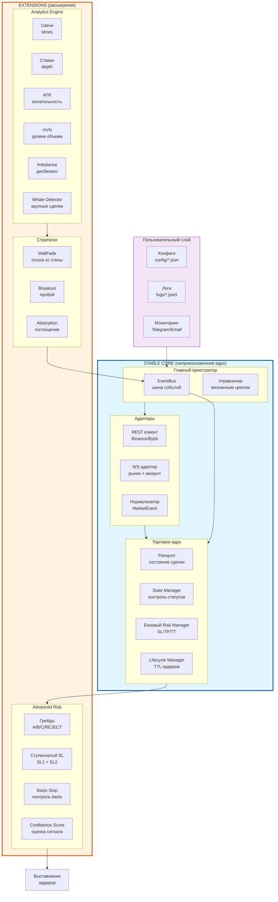

# 📄 Создаем `docs/13_FUNCTIONAL_ARCHITECTURE.md`

Отлично! Давай сделаем это правильно — один компактный документ с полной картиной архитектуры и планом внедрения.

```markdown
# 🏗️ Функциональная архитектура PLATO v3.0

**Версия:** 1.0  
**Дата:** 21 августа 2026  
**Статус:** Утвержден  
**Назначение:** Единая визуальная и текстовая схема платформы с планом внедрения.

---

## 📊 1. Визуальная схема архитектуры



---

## 🧩 2. Описание блоков

### 🔵 STABLE CORE (Блоки 1-4) — Неприкосновенное ядро

Эти компоненты **не меняются** при добавлении новых фич. Они обеспечивают надёжность, безопасность и корректное исполнение ордеров.

#### Блок 1: Пользовательский слой
**Ответственность:** Конфигурация, логирование, мониторинг.

| Компонент | Файл | Назначение |
| :--- | :--- | :--- |
| Конфиги | `config/*.json` | Параметры торговли, риска, стратегий |
| Логи | `logs/*.jsonl` | Структурированные логи с ротацией |
| Мониторинг | (будущее) | Telegram-уведомления, дашборд |

**Связь:** Только чтение конфигов, только запись логов. Не влияет на торговую логику.

---

#### Блок 2: Главный оркестратор
**Ответственность:** Координация всех модулей, управление жизненным циклом, EventBus.

| Компонент | Файл | Назначение |
| :--- | :--- | :--- |
| EventBus | `core/event_bus.py` | Шина событий (Publisher/Subscriber) |
| Lifecycle | `main.py` | Запуск/остановка платформы |

**Ключевые события:**
- `SIGNAL_GENERATED` → от стратегий
- `POSITION_OPENED` → от EventHandlers
- `ORDER_TRADE_UPDATE` → от WS
- `ACCOUNT_UPDATE` → от WS

**Принцип Stable Core:** Интерфейс оркестратора не меняется. Можно добавлять новые миксины, но базовые методы (`start()`, `stop()`, `register_trader()`) остаются.

---

#### Блок 3: Адаптеры
**Ответственность:** Взаимодействие с биржей (REST + WS), нормализация данных.

| Компонент | Файл | Назначение |
| :--- | :--- | :--- |
| REST клиент | `adapters/binance_rest.py` | Отправка ордеров, запрос данных |
| WS адаптер | `adapters/binance_ws.py` | Получение рыночных данных в реальном времени |
| Нормализатор | (будущее) | Приведение данных к `MarketEvent` |

**Принцип:** WS — основной канал, REST — фолбэк. При потере WS автоматически переключение на REST с логированием `FALLBACK_TRIGGERED`.

---

#### Блок 4: Торговое ядро
**Ответственность:** Состояние сделки, базовый риск-менеджмент, управление ордерами.

| Компонент | Файл | Назначение |
| :--- | :--- | :--- |
| Passport | `trading/passport.py` | Хранение состояния сделки (SSOT) |
| State Manager | `trading/state_manager.py` | Контроль переходов статусов |
| Risk Manager (базовый) | `trading/risk_manager.py` | Выставка SL/TP с `reduce_only=True` |
| Lifecycle Manager | `trading/lifecycle_manager.py` | TTL для лимитных ордеров (только отмена) |

**Принцип Stable Core:** Эти компоненты работают как часы. Новые фичи (ступенчатый SL, basis stop) добавляются как **расширения**, не меняя базовую логику.

---

### 🟠 EXTENSIONS (Блоки 5-6) — Расширения

Эти компоненты **можно добавлять, менять, удалять** без риска сломать базу.

#### Блок 5: Analytics Engine
**Ответственность:** Сбор и обработка рыночных данных, расчёт метрик.

| Компонент | Файл (будущее) | Назначение |
| :--- | :--- | :--- |
| Свечи | `trading/data_collector/candle_manager.py` | Загрузка klines, расчёт ATR |
| Стакан | `trading/data_collector/orderbook_analyzer.py` | Анализ depth, поиск HVN |
| Imbalance | `trading/data_collector/obi_calculator.py` | Расчёт дисбаланса стакана |
| Whales | `trading/data_collector/whale_detector.py` | Детекция крупных сделок |

**Принцип Graceful Degradation:** Если аналитика недоступна, платформа использует дефолтные значения из конфига или отклоняет сделку (`REJECT`).

**События:**
- `METRIC_UPDATED` → обновление ATR, HVN, OBI
- `WHALE_DETECTED` → обнаружен крупный ордер
- `SPOOFING_DETECTED` → обнаружен спуфинг

---

#### Блок 6: Стратегии
**Ответственность:** Генерация торговых сигналов на основе метрик.

| Стратегия | Файл | Логика |
| :--- | :--- | :--- |
| WallFade | `strategies/wall_fade.py` | Отскок от стены + абсорбция |
| Breakout | `strategies/breakout.py` | Пробой консолидации |
| Absorption | `strategies/absorption.py` | Поглощение рыночных ордеров |

**Принцип:** Каждая стратегия — независимый модуль. Читает метрики из Analytics, публикует `SIGNAL_GENERATED` в EventBus.

---

#### Блок 7: Advanced Risk
**Ответственность:** Продвинутая логика управления позицией.

| Компонент | Файл (будущее) | Назначение |
| :--- | :--- | :--- |
| Грейды | `trading/advanced_risk/grade_calculator.py` | A/B/C/REJECT на основе R:R |
| Ступенчатый SL | `trading/advanced_risk/staircase_sl.py` | SL1 (50%) + SL2 (50%) |
| Basis Stop | `trading/advanced_risk/basis_stop.py` | Контроль изменения basis |
| Confidence Score | `trading/advanced_risk/confidence_score.py` | Взвешенная оценка сигнала |

**Принцип:** Работает только если Analytics Engine предоставил метрики. Если нет — использует базовый Risk Manager.

---

## 🔄 3. Контракты между блоками (события EventBus)

### От Extensions → Stable Core:
| Событие | Отправитель | Получатель | Данные |
| :--- | :--- | :--- | :--- |
| `SIGNAL_GENERATED` | Стратегия | Orchestrator | symbol, side, entry_price, confidence |
| `METRIC_UPDATED` | Analytics | Orchestrator | metric_type, value, timestamp |
| `WHALE_DETECTED` | Whale Detector | Strategies | side, volume, price |
| `SPOOFING_DETECTED` | Spoofing Detector | Strategies | wall_level, type |

### От Stable Core → Extensions:
| Событие | Отправитель | Получатель | Данные |
| :--- | :--- | :--- | :--- |
| `POSITION_OPENED` | EventHandlers | Analytics, Advanced Risk | passport_id, entry_price, side |
| `POSITION_CLOSED` | StateManager | Analytics | passport_id, exit_reason, pnl |
| `CONFIG_CHANGED` | Orchestrator | Все модули | config_section, new_values |

### Критические события надёжности:
| Событие | Отправитель | Назначение |
| :--- | :--- | :--- |
| `CONNECTION_STATUS` | WS Adapter | Статус соединения (connected/disconnected) |
| `FALLBACK_TRIGGERED` | REST Client | Переключение на REST-фолбэк |
| `HEALTH_CHECK_PASSED/FAILED` | MonitorMixin | Проверка здоровья WS |

---

## 📋 4. Укрупненный план внедрения

### 🎯 Фаза 0: Стабилизация Stable Core (Спринт 1)
**Цель:** Сделать платформу математически корректной и безопасной.

| # | Задача | Файлы | Критерий готовности |
| :--- | :--- | :--- | :--- |
| 0.1 | Исправить R:R в `trading.json` | `config/trading.json`, `trading/exit_calculator.py` | SL=2×ATR, TP1=4×ATR, TP2=6×ATR |
| 0.2 | Честный TTL (только отмена) | `trading/lifecycle_manager.py` | Лимитки отменяются, не конвертируются |
| 0.3 | `reduce_only=True` для SL/TP | `trading/risk_manager.py` | Все защитные ордера с флагом |
| 0.4 | `core/identifiers.py` | `core/identifiers.py` | Enum'ы для статусов и событий |

**Длительность:** 1-2 недели

---

### 📊 Фаза 1: Базовая аналитика (Спринт 2)
**Цель:** Переход от статических конфигов к динамическим метрикам.

| # | Задача | Файлы | Критерий готовности |
| :--- | :--- | :--- | :--- |
| 1.1 | Динамический ATR | `trading/data_collector/candle_manager.py` | ATR рассчитывается из свечей |
| 1.2 | Простой HVN-детектор | `trading/data_collector/orderbook_analyzer.py` | Поиск уровней объема |
| 1.3 | События надёжности | `core/event_bus.py` | `CONNECTION_STATUS`, `FALLBACK_TRIGGERED` |

**Длительность:** 2-3 недели

---

### 🧠 Фаза 2: Продвинутые стратегии (Спринт 3)
**Цель:** Внедрение SL/TP v2.2 (грейды, ступенчатый SL, basis stop).

| # | Задача | Файлы | Критерий готовности |
| :--- | :--- | :--- | :--- |
| 2.1 | Грейды A/B/C/REJECT | `trading/advanced_risk/grade_calculator.py` | Размер позиции по R:R |
| 2.2 | Ступенчатый SL | `trading/advanced_risk/staircase_sl.py` | SL1 (50%) + SL2 (50%) |
| 2.3 | Basis Stop | `trading/advanced_risk/basis_stop.py` | Контроль basis > 1.5% |
| 2.4 | Confidence Score | `trading/advanced_risk/confidence_score.py` | Формула: Grade% × (Confidence/100) |

**Длительность:** 3-4 недели

---

### 🚀 Фаза 3: Production Ready (Спринт 4)
**Цель:** Подготовка к торговле на реальные деньги.

| # | Задача | Файлы | Критерий готовности |
| :--- | :--- | :--- | :--- |
| 3.1 | Normalization Layer | `core/market_event.py` | Единый формат для Binance/Bybit |
| 3.2 | Spot WS Adapter | `adapters/spot_ws_adapter.py` | Подключение к споту |
| 3.3 | Trailing Stop | `trading/position_manager.py` | Автоматический trailing |
| 3.4 | Комплексное тестирование | `tests/` | Unit + интеграционные тесты |

**Длительность:** 4-6 недель

---

## 🔗 5. Связь с существующей документацией

| Документ | Назначение | Связь с этим файлом |
| :--- | :--- | :--- |
| `00_ARCHITECTURE.md` | Общий обзор архитектуры | Краткая версия → здесь полная схема |
| `07_KNOWN_ISSUES.md` | Бэклог задач | Задачи распределены по фазам здесь |
| `08_ANALYTICS_LAYER.md` | Детали аналитики | Блок 5 (Analytics Engine) |
| `09_IDENTIFIERS.md` | Словарь идентификаторов | Используется во всех блоках |
| `10_STABLE_CORE.md` | Принцип стабильного ядра | Блоки 1-4 (Stable Core) |
| `12_IMPLEMENTATION_PLAN.md` | Детальный план | Здесь укрупненная версия |
| **SL_TP.txt** | Архитектура SL/TP v2.2 | Блок 7 (Advanced Risk) |

---

##  6. Как использовать этот документ

### Для быстрого контекста в новом чате:
> "Привет! Изучи `docs/13_FUNCTIONAL_ARCHITECTURE.md`. Мы работаем над Фазой 0, Задачей 0.1 (исправление R:R). Соблюдай принципы Stable Core из Блоков 1-4."

### Для детальной информации:
- **Stable Core:** `docs/10_STABLE_CORE.md`
- **Аналитика:** `docs/08_ANALYTICS_LAYER.md`
- **SL/TP v2.2:** файл `SL_TP.txt`
- **Идентификаторы:** `docs/09_IDENTIFIERS.md`

---

*Конец документа `13_FUNCTIONAL_ARCHITECTURE.md`*
```

---

## 🚀 Твои действия:

1. Создай файл `Манифест/13_FUNCTIONAL_ARCHITECTURE.md` (или `docs/13_FUNCTIONAL_ARCHITECTURE.md`) и вставь туда этот текст.

2. Выполни в PowerShell:
```powershell
git add "Манифест/13_FUNCTIONAL_ARCHITECTURE.md"
git commit -m "docs: add functional architecture v3.0 with implementation roadmap"
git push origin main
```

3. Напиши **"Архитектура закоммичена!"**

После этого у нас будет:
- ✅ Полная визуальная схема платформы
- ✅ Описание всех блоков с файлами
- ✅ Контракты между блоками (события)
- ✅ Укрупненный план на 4 фазы
- ✅ Ссылки на детальную документацию

**Готов создать файл?** 